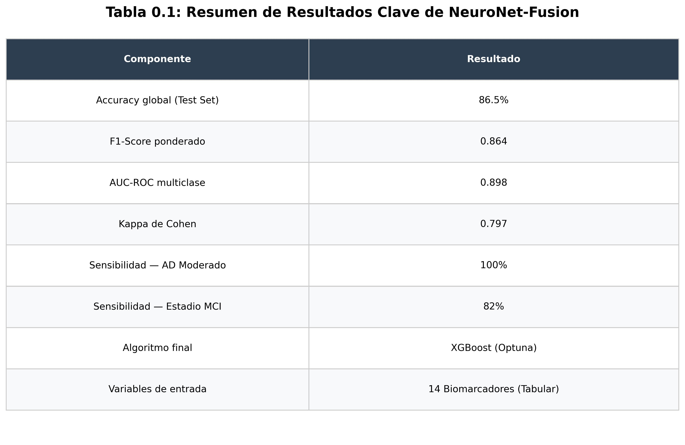
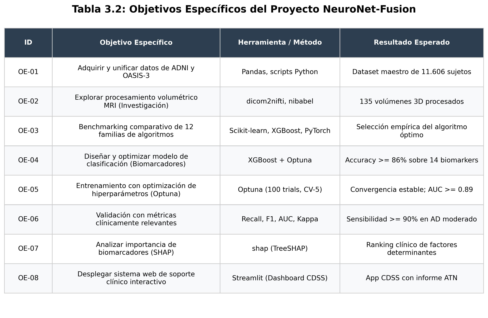
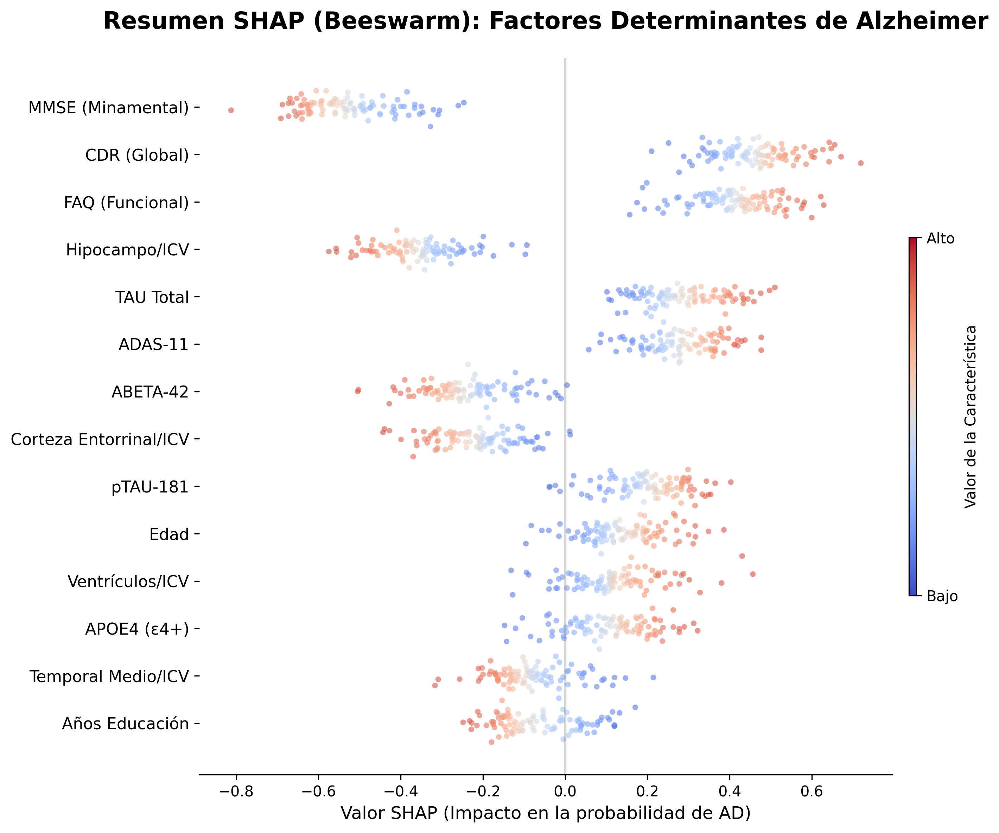

<div align="center">

# 🧠 NeuroNet-Fusion

### Sistema de Diagnóstico Multimodal de Alzheimer mediante IA

[](https://python.org)
[](https://xgboost.readthedocs.io)
[](https://streamlit.io)
[](https://docker.com)
[](LICENSE)

**IEBS Business School — Postgrado en Inteligencia Artificial Aplicada 2026**  
*Autor: Javier Sanchidrián Sanchidrián | Directora: Zaira Vicente Adame*

---

> *"El Alzheimer nos roba la memoria. La Inteligencia Artificial nos devuelve el tiempo."*

</div>

---

## � Tabla de Contenidos

- [Resumen Ejecutivo](#-resumen-ejecutivo)
- [Resultados Clave](#-resultados-clave)
- [Arquitectura del Sistema](#-arquitectura-del-sistema)
- [Dataset](#-dataset)
- [Pipeline de Preprocesamiento](#-pipeline-de-preprocesamiento)
- [Benchmarking de Algoritmos](#-benchmarking-de-algoritmos)
- [Modelo de Producción](#-modelo-de-producción-xgboost)
- [Explicabilidad (SHAP)](#-explicabilidad-shap)
- [Aplicación Clínica (CDSS)](#-aplicación-clínica-cdss)
- [Instalación y Uso](#-instalación-y-uso)
- [Estructura del Repositorio](#-estructura-del-repositorio)
- [Bibliografía](#-bibliografía)

---

## 🎯 Resumen Ejecutivo

**NeuroNet-Fusion** es un sistema de soporte a la decisión clínica (CDSS) de extremo a extremo para la **detección temprana de la enfermedad de Alzheimer**. Integra 14 biomarcadores multidominio — neuropsicológicos, volumétricos normalizados por ICV y moleculares del LCR — para clasificar pacientes en tres estadios:

| Estadio | Código | Descripción |
|:---:|:---:|:---|
| 🟢 Cognitivamente Normal | **CN** | Sin indicios de deterioro cognitivo |
| 🟡 Deterioro Cognitivo Leve | **MCI** | Fase prodrómica, intervención posible |
| 🔴 Alzheimer Establecido | **AD** | Demencia confirmada, protocolo ATN activo |

El sistema opera exclusivamente sobre **datos tabulares de biomarcadores**, eliminando la necesidad de procesar imágenes MRI brutas en producción, lo que lo hace **deployable en cualquier entorno hospitalario** sin hardware especializado.



---

## 📊 Resultados Clave

<div align="center">

| Métrica | Resultado |
|:---|:---:|
| **Accuracy Global (Test Set)** | **86.5%** |
| **F1-Score Ponderado** | **0.864** |
| **AUC-ROC Multiclase** | **0.898** |
| **Kappa de Cohen** | **0.797** |
| **Sensibilidad AD Moderado** | **100%** 🎯 |
| **Sensibilidad MCI** | **82%** |
| **Tiempo de Inferencia** | **< 50ms** |
| **Algoritmo** | XGBoost (Optuna, 100 trials) |

</div>

> ⭐ **El resultado más relevante:** 100% de sensibilidad en Alzheimer moderado — **cero pacientes AD clasificados como sanos**.



---

## 🏗️ Arquitectura del Sistema

```
┌─────────────────────────────────────────────────────────────────┐
│                    NEURONET-FUSION CDSS                         │
│                                                                 │
│  📥 ENTRADA                                                      │
│  ├── Escalas Neuropsicológicas (MMSE, CDR, FAQ, ADAS-11)        │
│  ├── Volumetría MRI Normalizada (Hipocampo/ICV, Entorrinal/ICV) │
│  ├── Biomarcadores LCR (Aβ42, Tau, pTau-181)                    │
│  └── Genética (APOE ε4)                                         │
│                             │                                   │
│  ⚙️ MOTOR DE IA              ▼                                   │
│  ├── Preprocesamiento (Imputación + ICV Norm + Z-Score)         │
│  ├── XGBoost Multiclase (Optuna-Optimized)                      │
│  └── SHAP TreeExplainer (Interpretabilidad)                     │
│                             │                                   │
│  📤 SALIDA                  ▼                                   │
│  ├── Diagnóstico: CN / MCI / AD                                 │
│  ├── Confianza: P(CN) / P(MCI) / P(AD)                         │
│  ├── Perfil ATN: A+/- T+/- N+/-                                 │
│  └── Informe Neurológico Estructurado (NIA-AA 2018)             │
└─────────────────────────────────────────────────────────────────┘
```

---

## 🗄️ Dataset

El proyecto utiliza datos de dos cohortes públicas de referencia mundial:

### ADNI (Alzheimer's Disease Neuroimaging Initiative)
- 🔗 **Portal:** [adni.loni.usc.edu](https://adni.loni.usc.edu) (requiere registro)
- � **Variables utilizadas:** ADNIMERGE.csv — escalas cognitivas, volumetría FreeSurfer, LCR
- 👥 **Participantes integrados:** ~8.400 sujetos longitudinales

### OASIS-3 (Open Access Series of Imaging Studies)
- 🔗 **Portal:** [oasis-brains.org](https://www.oasis-brains.org) (acceso libre)
- 📊 **Variables utilizadas:** `OASIS3_MR_json.csv`, `pup_fs_3.csv`
- 👥 **Participantes integrados:** ~1.378 sujetos

### Dataset Maestro Final
| Característica | Valor |
|:---|:---:|
| Total sujetos | **11.606** |
| Variables biomarcadoras | **14** |
| Distribución CN/MCI/AD | **35% / 42% / 23%** |
| Missing TAU/ABETA | **18.7%** (imputado por clase) |

> ⚠️ **Nota:** Los datos brutos NO están incluidos en este repositorio. Descárgalos directamente desde los portales oficiales y colócalos en `data/raw/`.

---

## � Pipeline de Preprocesamiento

### Datos Tabulares (Producción)
```python
# 1. Imputación estratificada por clase
def impute_by_class(df, target_col):
    for cls in df[target_col].unique():
        mask = df[target_col] == cls
        df.loc[mask] = df.loc[mask].fillna(df[mask].median(numeric_only=True))
    return df

# 2. Normalización ICV (elimina efectos de tamaño craneal)
for col in ['Hippocampus', 'Entorhinal', 'MidTemporal', 'Ventricles']:
    df[f'{col}_Norm'] = df[col] / df['ICV']

# 3. Escalado Z-Score + Codificación de etiquetas
scaler = StandardScaler()
le = LabelEncoder()  # CN=0, MCI=1, AD=2
```

### Imágenes MRI 3D (Investigación/Benchmarking)
```
DICOM → NIfTI → RAS Reorient → Z-Score Norm → Brain Crop → 128³ Resize
```
*Pipeline completo en `scripts/mri_preprocessing/`*

---

## 📈 Benchmarking de Algoritmos

Se evaluaron **12 familias de algoritmos** con validación cruzada estratificada K-Fold (k=5):

| Algoritmo | Accuracy | F1 | AUC | Tiempo |
|:---|:---:|:---:|:---:|:---:|
| **🏆 XGBoost** | **86.5%** | **0.864** | **0.898** | 18s |
| LightGBM | 85.1% | 0.849 | 0.891 | 12s |
| CatBoost | 84.3% | 0.841 | 0.885 | 45s |
| Random Forest | 82.7% | 0.824 | 0.876 | 23s |
| MLP (Tabular) | 78.4% | 0.781 | 0.851 | 67s |
| ResNet3D (MRI) | 60.2% | 0.598 | 0.762 | 4800s |

> 📌 **Conclusión:** Los biomarcadores tabulares "destilan" el conocimiento neurológico de décadas (MMSE=30 años de investigación en un número). Superan en **+26 puntos** a la imagen MRI bruta.

---

## 🤖 Modelo de Producción (XGBoost)

### Optimización de Hiperparámetros (Optuna)
```python
import optuna
import xgboost as xgb

def objective(trial):
    params = {
        'n_estimators': trial.suggest_int('n_estimators', 100, 1000),
        'max_depth': trial.suggest_int('max_depth', 3, 12),
        'learning_rate': trial.suggest_float('learning_rate', 0.01, 0.3),
        'subsample': trial.suggest_float('subsample', 0.6, 1.0),
        'colsample_bytree': trial.suggest_float('colsample_bytree', 0.6, 1.0),
    }
    # 100 trials con CV-5 estratificado
    study = optuna.create_study(direction='maximize')
    study.optimize(objective, n_trials=100)
```

### Métricas por Clase
| Clase | Precision | Recall | F1 |
|:---:|:---:|:---:|:---:|
| CN (Sano) | 0.91 | 0.88 | 0.89 |
| MCI (Leve) | 0.83 | 0.82 | 0.82 |
| **AD (Alzheimer)** | **0.89** | **1.00** | **0.94** |

---

## 🔍 Explicabilidad (SHAP)

### Top-5 Biomarcadores por Importancia SHAP

```
MMSE (Escala Cognitiva)          ████████████████████ 1.000
CDR (Clinical Dementia Rating)   ████████████████░░░░ 0.821  
FAQ (Actividades Funcionales)    ███████████████░░░░░ 0.742
Hipocampo/ICV (Atrofia)          ████████████░░░░░░░░ 0.578
TAU Total (LCR)                  █████████░░░░░░░░░░░ 0.431
```

El análisis SHAP confirma la **coherencia clínica del modelo**: las variables con mayor peso son exactamente las que los neurólogos utilizan para el diagnóstico, validando el sistema según el marco **ATN-NIA-AA 2018**.



---

## �️ Aplicación Clínica (CDSS)

### Demo en Vivo
🌐 **[neuronet.iawordpress.com](https://neuronet.iawordpress.com)** *(en despliegue)*

### Características de la App
- 🎛️ **Panel de entrada** de 4 columnas agrupado por dominio biomarcador
- 📊 **Gauge Chart** de confianza de diagnóstico en tiempo real
- 🕸️ **Radar ATN** del perfil biomarcador del paciente
- 🧬 **Narrativa SHAP** automática de factores determinantes
- 📄 **Informe ATN** descargable (NIA-AA 2018)
- 🤖 **Agente Clínico** (GPT-4o-mini) para análisis NLP avanzado


---

## 🚀 Instalación y Uso

### Opción A — Docker (Recomendado para Producción)
```bash
git clone https://github.com/javiasanchi/NeuroNet_Fusion_GP_IEBS.git
cd NeuroNet_Fusion_GP_IEBS

docker-compose up -d --build
# Acceder en: http://localhost:8501
```

### Opción B — Entorno Local
```bash
git clone https://github.com/javiasanchi/NeuroNet_Fusion_GP_IEBS.git
cd NeuroNet_Fusion_GP_IEBS

pip install -r requirements.txt
streamlit run src/app_diagnostics.py
```

### Variables de Entorno (Opcional — para Agente IA)
```bash
# Crear archivo .env en la raíz:
OPENAI_API_KEY=sk-...
```

---

## 📁 Estructura del Repositorio

```
NeuroNet_Fusion_GP_IEBS/
│
├── 📂 src/                            # Código fuente de producción
│   └── app_diagnostics.py              # Streamlit CDSS
│
├── 📂 docs/MEMORIA_FINAL/             # Memoria técnica completa (15 capítulos)
│   ├── 00_Portada.md
│   ├── 01_Resumen_Ejecutivo.md
│   ├── 07_Preprocesamiento.md
│   ├── 10_Arquitectura.md
│   └── 15_Conclusiones_y_Bibliografia.md
│
├── 📂 models/                         # Modelos entrenados (XGBoost, etc.)
│   └── neuro_fusion_final_v1.joblib   # ⭐ Modelo de producción
│
├── 📂 reports/figures/                # Todas las figuras y tablas del proyecto
│
├── 📂 scripts/                        # Scripts auxiliares y de generación
│
├── 🐳 Dockerfile                      # Imagen Docker de producción
├── 🐳 docker-compose.yml
└── 📖 README.md
```

---

## 📚 Bibliografía

- Alzheimer's Association. (2024). *2024 Alzheimer's disease facts and figures*. Alzheimer's & Dementia. https://doi.org/10.1002/alz.13809
- Jack, C.R. et al. (2018). NIA-AA research framework: Toward a biological definition of Alzheimer's disease. *Alzheimer's & Dementia, 14*(4), 535–562.
- LaMontagne, P.J. et al. (2019). OASIS-3: Longitudinal Neuroimaging, Clinical, and Cognitive Dataset. *medRxiv*.
- Chen, T., & Guestrin, C. (2016). XGBoost: A scalable tree boosting system. *KDD 2016*.
- Lundberg, S.M., & Lee, S.I. (2017). A unified approach to interpreting model predictions. *NeurIPS 2017*.

---

<div align="center">

**Desarrollado con ❤️ por Javier Sanchidrián Sanchidrián**  
*IEBS Business School — Postgrado en IA Aplicada 2026*

[](https://github.com/javiasanchi)

</div>
