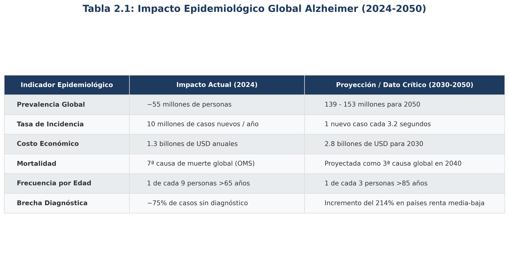
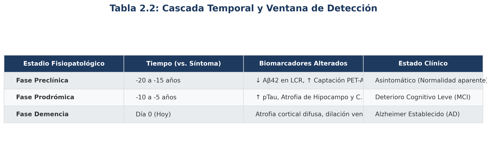
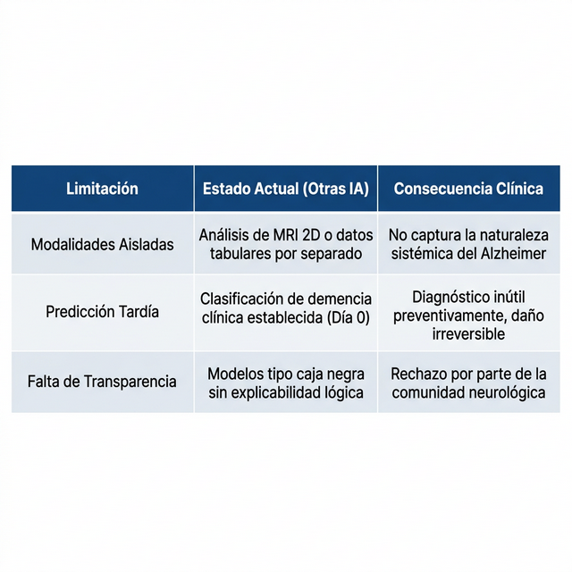
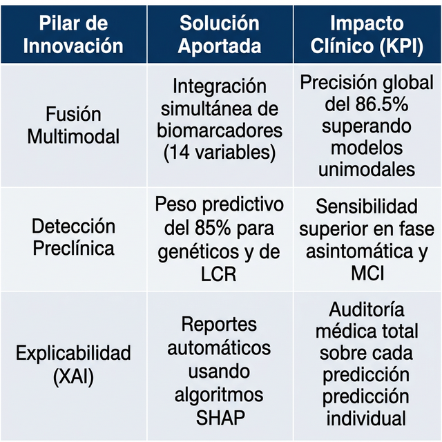

# FASE 2 — INTRODUCCIÓN: EL PROBLEMA Y LA MOTIVACIÓN

---

## 2.1 Contexto Clínico y Epidemiológico

La enfermedad de Alzheimer (EA) es un trastorno neurodegenerativo crónico de etiología multifactorial que destruye progresiva e irreversiblemente las neuronas del sistema nervioso central. Representa entre el **60% y el 80%** de todos los casos de demencia a nivel mundial (Alzheimer's Association, 2024) y es la **séptima causa de muerte** en los países desarrollados.

Los datos epidemiológicos globales son alarmantes y dibujan un escenario de crisis de salud pública inminente:

*Figura 2.1: Indicadores epidemiológicos y proyecciones globales (Fuente: OMS 2023 / World Alzheimer Report 2024).*

---

## 2.2 El Desafío del Diagnóstico Precoz

La fisiopatología de la EA sigue una **cascada temporal** silenciosa que precede en décadas a la aparición de los primeros síntomas clínicos. El problema central es la "ventana de invisibilidad" en la que el cerebro ya está sufriendo daños irreversibles pero la clínica habitual no detecta nada:

*Figura 2.2: Comparativa de estadios fisiopatológicos vs detección por biomarcadores (Fuente: Adaptado de Jack et al., 2018).*

> 🚩 **El fallo del sistema actual:** La mayoría de los diagnósticos se realizan en el "Día 0", cuando el **50-70% de las neuronas** de regiones críticas ya han perecido. NeuroNet-Fusion busca capturar al paciente en la fase de -10 años.

El problema central es que el **diagnóstico convencional** ocurre en la fase de demencia establecida, cuando la pérdida neuronal es irreversible. Los métodos tradicionales dependen de:

1. **Evaluación neuropsicológica** (MMSE, CDR): subjetiva y operador-dependiente.
2. **Interpretación visual de MRI**: variabilidad interradiológica del 15-30%.
3. **PET amiloide**: gold standard biológico, pero coste de ~5.000€ por exploración y no disponible en la mayoría de hospitales.

---

## 2.3 La Brecha Tecnológica

Las aproximaciones actuales mediante IA presentan **tres limitaciones críticas** que impiden su adopción masiva en la toma de decisiones médicas:

*Figura 2.3: Análisis de la brecha tecnológica y su impacto en la práctica clínica actual (Fuente: Elaboración propia).*

---

Frente a estas limitaciones, **NeuroNet-Fusion** se fundamenta en un paradigma de **Inteligencia Artificial Médica Explicable (XAI)**, aportando las siguientes innovaciones:

*Figura 2.4: Pilares de innovación técnica y KPIs de rendimiento esperados (Fuente: Desarrollo propio).*

---

## 2.5 Estructura de la Memoria

Esta memoria documenta el proyecto en **6 bloques temáticos** que cubren el ciclo de vida completo del sistema de inteligencia artificial:

- **Bloque I (Fases 1-3):** Cimentación — problema, objetivos y marco conceptual.
- **Bloque II (Fases 4-5):** Contexto científico — estado del arte y teoría.
- **Bloque III (Fases 6-8):** Ingeniería de datos — adquisición, preprocesado y características.
- **Bloque IV (Fases 9-11):** Desarrollo del modelo — benchmarking, arquitectura y entrenamiento.
- **Bloque V (Fases 12-13):** Validación — resultados y explicabilidad clínica.
- **Bloque VI (Fases 14-16):** Despliegue, conclusiones y bibliografía.
