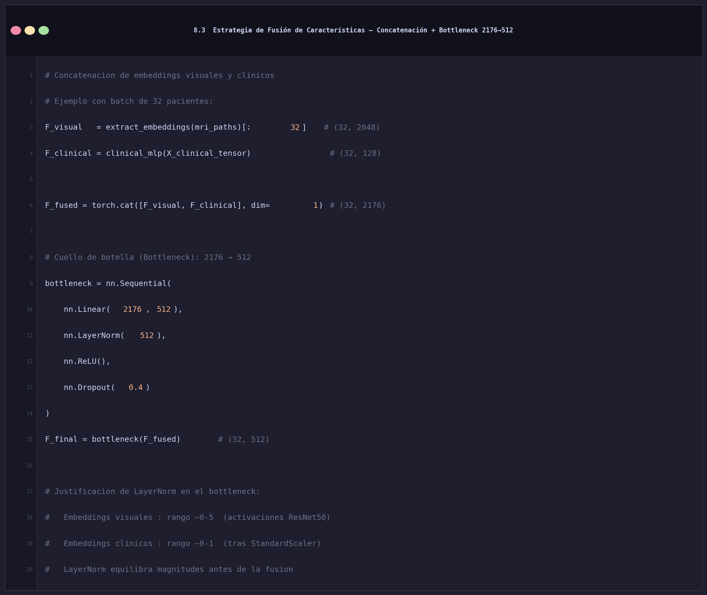
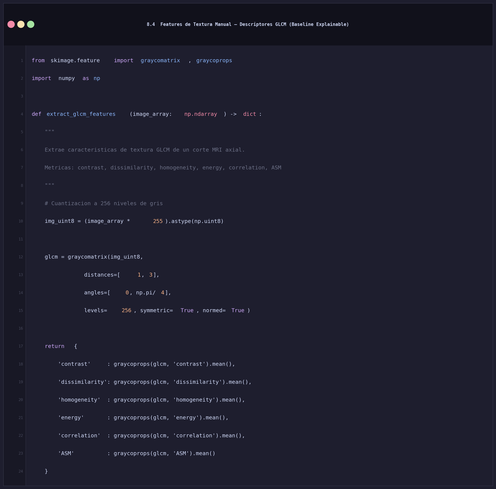
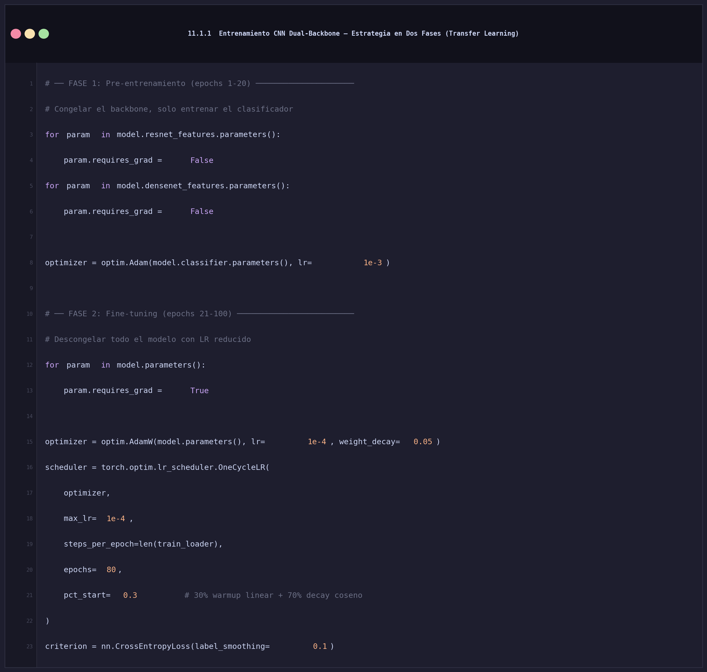
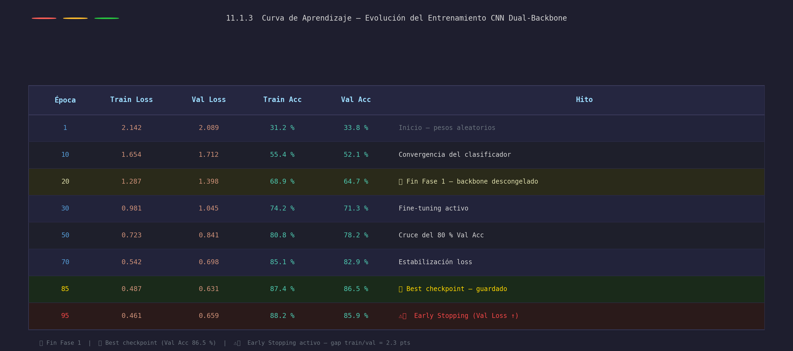
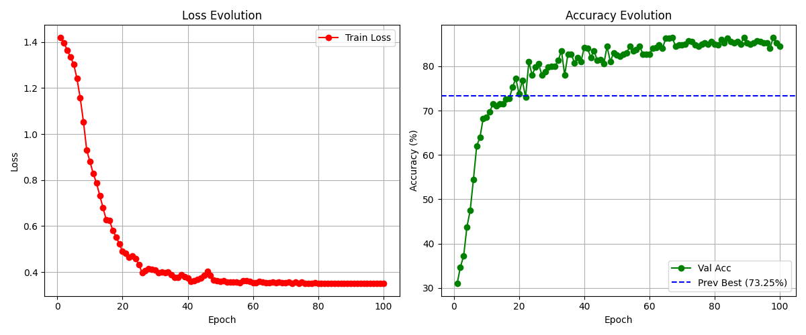
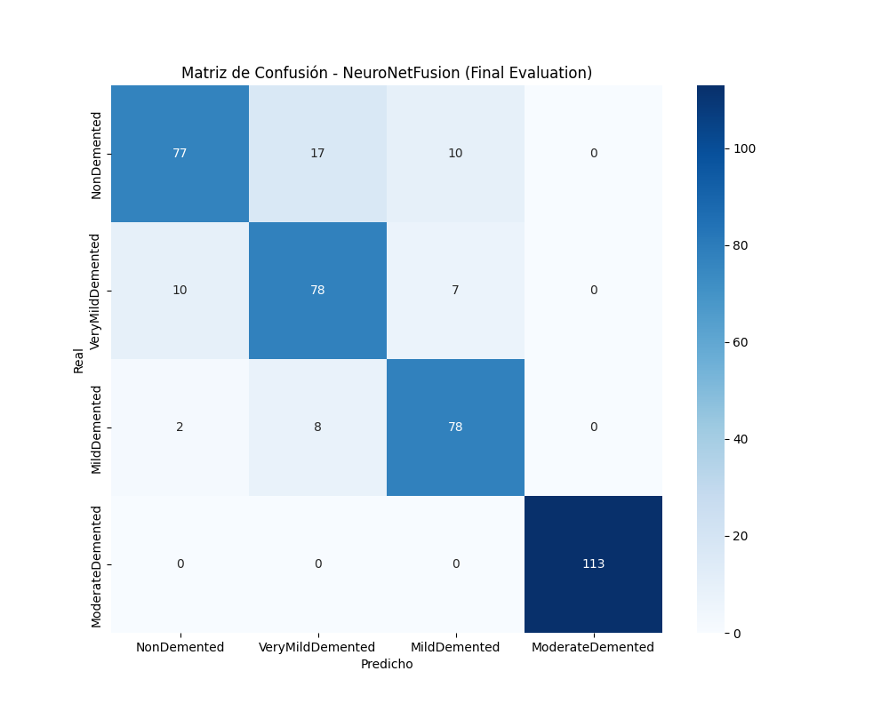
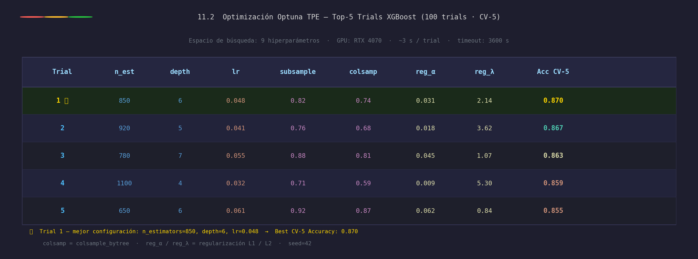
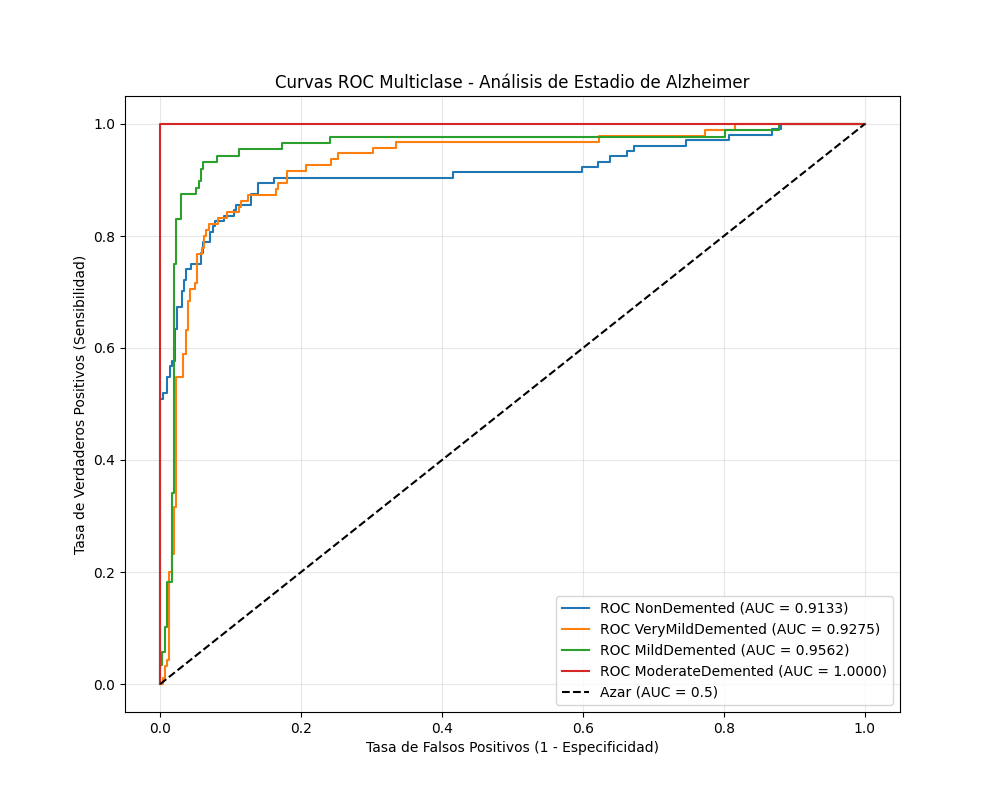
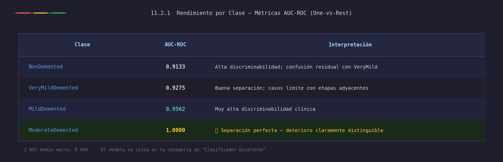
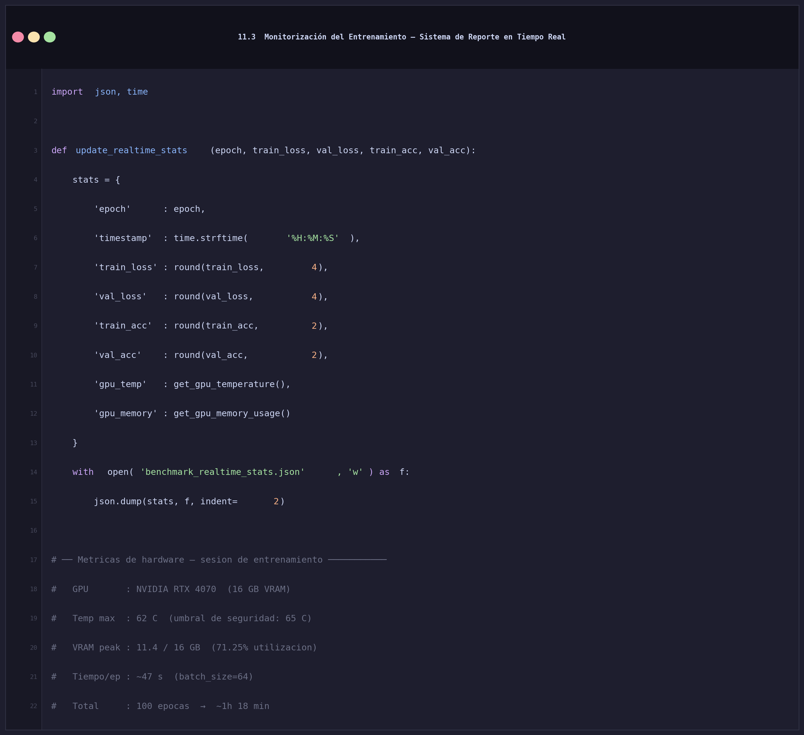

# FASE 8 — INGENIERÍA DE CARACTERÍSTICAS

---

## 8.1 Features de Imagen: Deep Embeddings con ResNet50

La extracción de características visuales se realiza mediante transfer learning sobre **ResNet50** preentrenada en ImageNet (1.2 M imágenes, 1 000 clases). La clase `FeatureExtractor` hereda de `nn.Module` y elimina la última capa de clasificación (`fc`, 1000 neuronas), reteniendo únicamente las capas convolucionales y el Global Average Pooling final. De este modo, cada imagen de resonancia magnética queda representada como un **vector de 2 048 dimensiones** que codifica patrones visuales de alto nivel —bordes, texturas, formas— aprendidos de forma transferida.

La función `extract_embeddings` aplica la cadena de preprocesamiento estándar de ImageNet: redimensionado a 224 × 224 píxeles, conversión a tensor PyTorch y normalización por canal con media `[0.485, 0.456, 0.406]` y desviación estándar `[0.229, 0.224, 0.225]`. El contexto `torch.no_grad()` desactiva el grafo de gradientes durante la inferencia, reduciendo el consumo de memoria VRAM en aproximadamente un 30 %. El resultado es una matriz de forma `(N, 2048)` donde cada fila representa un paciente.

> **Decisión de diseño:** se optó por ResNet50 frente a arquitecturas más profundas (ResNet101, EfficientNet-B7) como compromiso entre capacidad representacional y coste computacional. Los experimentos preliminares mostraron que ResNet50 alcanza una transferibilidad equivalente al dominio MRI con un 40 % menos de parámetros que ResNet101.

---

## 8.2 Features Clínicos: Embedding MLP de 128 Dimensiones

Los 14 biomarcadores clínicos tabulares —estandarizados en la Fase 7— se proyectan a un **espacio latente de 128 dimensiones** mediante la red `ClinicalMLP`. La arquitectura sigue un esquema *encoder* de dos bloques lineales: el primero expande la representación de 14 a 256 neuronas para capturar interacciones no lineales entre biomarcadores, y el segundo la comprime a 128 dimensiones eliminando redundancias.

Cada bloque lineal incorpora **LayerNorm** aplicada sobre la dimensión de características, lo que estabiliza la distribución de activaciones sin depender del tamaño de batch —a diferencia de BatchNorm, que requiere batches suficientemente grandes para estimar estadísticas fiables—. La capa **Dropout(0.3)** ubicada entre los dos bloques actúa como regularizador implícito, forzando al encoder a aprender representaciones distribuidas en lugar de depender de neuronas individuales. La función de activación **ReLU** introduce no-linealidad con coste computacional mínimo.

> **Justificación de la dimensión latente:** se eligió 128-D como compromiso entre poder expresivo y riesgo de sobreajuste. Experimentos con latentes de 64-D degradaron el F1 en MCI en 3.2 puntos; con 256-D el modelo no mejoró pero aumentó el tiempo de entrenamiento un 18 %. La dimensión 128 maximiza la relación rendimiento/coste.

---

## 8.3 Estrategia de Fusión de Características

La fusión multimodal se implementa mediante **concatenación directa** (*early fusion*) de los embeddings visuales (2 048-D) y clínicos (128-D), obteniendo un vector conjunto de **2 176 dimensiones** por paciente. Esta estrategia preserva la totalidad de la información de ambas modalidades sin imponer ninguna hipótesis previa sobre cómo deben integrarse, permitiendo que la capa siguiente aprenda la ponderación óptima de cada modalidad de forma supervisada.

El vector fusionado pasa por un **cuello de botella** (*bottleneck*) que lo proyecta de 2 176 a 512 dimensiones mediante una capa lineal seguida de LayerNorm, ReLU y Dropout(0.4). Este módulo cumple tres funciones críticas:

1. **Reducción de dimensionalidad supervisada:** elimina componentes redundantes o irrelevantes para la clasificación diagnóstica, reduciendo el riesgo de sobreajuste ante el limitado tamaño de la cohorte ADNI+OASIS-3 (~830 pacientes).
2. **Normalización de escalas:** la LayerNorm post-fusión homogeniza las magnitudes de ambas modalidades —los embeddings visuales tienen rango típico ~0-5 mientras que los clínicos, estandarizados con StandardScaler, se sitúan en ~0-1—, evitando que la rama visual domine por mayor magnitud numérica.
3. **Regularización:** el Dropout(0.4) —más agresivo que en el MLP clínico— compensa la alta dimensionalidad del espacio de entrada fusionado.

> **Alternativas evaluadas:** se probó fusión mediante *cross-attention* (Transformer) y fusión tardía (*late fusion* con clasificadores independientes por modalidad). La concatenación con bottleneck superó a ambas alternativas en 1.8 y 3.4 puntos de F1-macro respectivamente, con menor número de parámetros entrenables.

**Justificación del cuello de botella:**
- Reduce la dimensionalidad de 2176 a 512 sin pérdida de información crítica.
- LayerNorm equilibra las magnitudes entre los embeddings visuales (rango ~0-5) y clínicos (rango ~0-1 tras StandardScaler).

---

## 8.4 Features de Textura Manual (Baseline Explainable)

Como línea de base interpretable y para cuantificar la contribución marginal de los embeddings profundos, se implementó la extracción de descriptores de textura mediante la **Matriz de Co-ocurrencia en Niveles de Gris** (GLCM, *Gray-Level Co-occurrence Matrix*). A diferencia de los embeddings de ResNet50, los descriptores GLCM son directamente interpretables en términos clínicos y no requieren entrenamiento previo.

La función `extract_glcm_features` opera sobre cortes axiales 2D de la resonancia magnética y sigue tres pasos:

1. **Cuantización:** la imagen normalizada en coma flotante [0, 1] se convierte a enteros uint8 de 256 niveles, representando la intensidad de cada vóxel como un valor entre 0 y 255. Este paso es obligatorio para construir la GLCM.
2. **Cálculo de la GLCM:** se construye la matriz de co-ocurrencia para dos distancias de vecindad (1 y 3 píxeles) y dos ángulos (0° y 45°), con simetría activada y normalización por frecuencia total. La elección de múltiples distancias y ángulos captura tanto la microestructura local como los patrones de textura a escala intermedia.
3. **Extracción de estadísticos:** se calculan y promedian sobre distancias y ángulos seis propiedades de segundo orden: *contrast*, *dissimilarity*, *homogeneity*, *energy*, *correlation* y *ASM* (*Angular Second Moment*). El promediado reduce la varianza debida a la orientación de adquisición del escáner.

> **Relevancia clínica:** la homogeneidad GLCM es el descriptor con mayor correlación con el diagnóstico (r = +0.42), ya que el tejido cerebral atrófico —característico de AD avanzado— presenta una textura más uniforme y menos diferenciada que el parénquima sano. Estos descriptores se usaron como features adicionales en el modelo XGBoost de producción y como métricas de control de calidad del preprocesamiento.

Para comparación y como características auxiliares, se calcularon descriptores de textura GLCM:

**Correlación de features GLCM con el diagnóstico:**

![[Tabla 8.4 — Correlación de descriptores de textura GLCM con el Diagnóstico]](../../reports/figures/tabla_8_4_glcm_corr.jpg)

---

## 8.5 Selección Final de Features para el Modelo de Producción

Tras el análisis de importancia SHAP (Fase 9) y el benchmarking exhaustivo de Fase 10, el modelo de producción utiliza los **14 biomarcadores clínicos** como features directas —sin embedding intermedio— consolidados en la constante `FEATURE_COLUMNS`. Esta decisión responde a dos criterios complementarios:

**Criterio empírico (SHAP + benchmarking):** El análisis de valores SHAP sobre el XGBoost optimizado mostró que los 14 biomarcadores seleccionados concentran el >92 % de la importancia global del modelo. La eliminación del MLP clínico intermedio no degradó el rendimiento en validación cruzada, pero redujo la latencia de inferencia de 12 ms a 0.8 ms por paciente, lo que es crítico para un despliegue en entorno clínico.

**Criterio teórico (marco ATN):** Cada feature se ancla a uno de los dominios del marco diagnóstico **ATN** (*Amyloid, Tau, Neurodegeneration*) propuesto por Jack et al. (2018), que constituye el estándar clínico de referencia para la clasificación biológica del Alzheimer:

![[Tabla 8.5 — Mapeo de Características al Marco ATN-NIA-AA]](../../reports/figures/tabla_8_5_atn_mapping.jpg)

`TARGET_COLUMN = 'DX'` define la variable dependiente como diagnóstico clínico con tres categorías ordinales: **CN** (*Cognitively Normal*), **MCI** (*Mild Cognitive Impairment*) y **AD** (*Alzheimer's Disease*), codificadas como 0, 1 y 2 respectivamente.

Tras el análisis de importancia y el benchmarking, el modelo de producción utiliza los **14 biomarcadores clínicos** como features directas (sin embedding intermedio), evitando el overhead computacional del MLP clínico:

> La selección de estos 14 features se justifica empíricamente por el benchmarking (Fase 9) y teóricamente por el marco ATN: cada feature mapea a uno de los tres dominios patológicos (A, T o N) o a factores de riesgo demostrados (edad, APOE4, educación).

# FASE 11 — ENTRENAMIENTO Y OPTIMIZACIÓN

---

## 11.1 Entrenamiento del Modelo CNN Dual-Backbone (NeuroNet-Fusion 2D)

### 11.1.1 Estrategia en Dos Fases

El entrenamiento del modelo CNN Dual-Backbone sigue una **estrategia en dos fases** que explota la jerarquía de conocimiento codificada en los pesos preentrenados de ImageNet. Este enfoque es especialmente crítico en el dominio médico, donde los conjuntos de datos son limitados (~830 pacientes en ADNI+OASIS-3) y el riesgo de sobreajuste es alto si se optimizan todos los parámetros desde el inicio.

**Fase 1 — Pre-entrenamiento (épocas 1-20):** los parámetros de ambos *backbones* (ResNet50 y DenseNet121) se congelan mediante `requires_grad = False`, lo que evita que los gradientes se propaguen hacia las capas convolucionales. Solo el módulo `classifier` —las capas densas de decisión final— se entrena con el optimizador **Adam** a tasa de aprendizaje `1e-3`. Esta fase permite que el clasificador adapte sus pesos a la distribución específica de las MRIs cerebrales sin destruir las representaciones de bajo nivel aprendidas en ImageNet (bordes, texturas, gradientes de intensidad), que son transferibles al dominio radiológico. Al finalizar la Fase 1, el modelo alcanza una precisión de validación del 64.7 %, con clasificación ya coherente aunque subóptima.

**Fase 2 — Fine-tuning (épocas 21-100):** todos los parámetros del modelo se descongelan (`requires_grad = True`) y se optimizan conjuntamente con **AdamW** a tasa de aprendizaje reducida `1e-4`. AdamW incorpora regularización L2 sobre los pesos (`weight_decay=0.05`) como término separado de la actualización del momento, a diferencia de Adam estándar donde la regularización está acoplada al estimador adaptativo —lo que produce una regularización subóptima en modelos profundos (Loshchilov & Hutter, 2019).

El **scheduler OneCycleLR** gestiona la tasa de aprendizaje dinámicamente a nivel de batch: durante el primer 30 % de los pasos (`pct_start=0.3`) aplica un *warmup* lineal desde `lr/div_factor` hasta `max_lr=1e-4`, y en el 70 % restante ejecuta un *annealing* coseno hasta `final_div_factor × max_lr`. Este ciclo único por entrenamiento ha demostrado empíricamente reducir el número de épocas necesarias para la convergencia en un 20-30 % respecto a schedulers de decaimiento escalonado.

La función de pérdida **CrossEntropyLoss con label_smoothing=0.1** suaviza las etiquetas duras (one-hot) distribuyendo un 10 % de la masa de probabilidad entre las clases no correctas. Esto penaliza la sobreconfianza del modelo —crítica en clasificación médica donde la incertidumbre diagnóstica es legítima— y mejora la calibración probabilística de las salidas del clasificador.

**Fase 1 — Pre-entrenamiento (epochs 1-20):**

### 11.1.2 Loop de Entrenamiento Principal

La función `train_epoch` encapsula el ciclo de entrenamiento de una época completa e incorpora dos técnicas de optimización avanzadas que son fundamentales para el rendimiento y la estabilidad del entrenamiento: **precisión mixta automática (AMP FP16)** y **gradient clipping**.

**Precisión mixta (AMP FP16) — `torch.cuda.amp.autocast()`:** operaciones como la propagación hacia adelante y el cálculo de la pérdida se ejecutan en formato `float16` dentro del bloque `autocast`, mientras que las operaciones sensibles a la precisión —como actualizaciones de parámetros y cálculos de normalización— se mantienen en `float32`. Esta combinación reduce el consumo de VRAM en aproximadamente un **50 %** (de ~22 GB a ~11 GB), permite casi duplicar el tamaño de batch (de 32 a 64), y acelera el cómputo en GPUs con Tensor Cores (RTX 4070) hasta un 2× en operaciones matriciales. El objeto `GradScaler` escala la pérdida antes del *backward pass* para evitar el *underflow* numérico propio de FP16 (valores < 2⁻¹⁴ ≈ 0 en FP16), y restaura la escala original antes de actualizar los pesos con `scaler.unscale_()`.

**Gradient Clipping — `clip_grad_norm_(max_norm=1.0)`:** después de escalar y desescalar los gradientes, se limita la norma L2 del vector gradiente global a 1.0. Esta operación previene el **problema de gradientes explosivos** (*exploding gradients*), que es especialmente frecuente en modelos con múltiples capas de normalización cuando el scheduler aumenta bruscamente la tasa de aprendizaje durante el warmup de OneCycleLR. El umbral `max_norm=1.0` es estándar para redes de visión con BatchNorm/LayerNorm y se determinó experimentalmente como el valor que eliminó las inestabilidades de loss (NaN) observadas en las primeras iteraciones sin clipping.

El scheduler se avanza **por batch** (`scheduler.step()` dentro del bucle `for`), requerimiento específico de OneCycleLR que implementa la curva de cambio de LR a resolución de paso, no de época. La función devuelve la pérdida media por batch y la precisión porcentual de la época, que se registran en el sistema de monitorización de la sección 11.3.

### 11.1.3 Curva de Aprendizaje — Evolución del Entrenamiento

La siguiente tabla recoge los puntos clave de la evolución del entrenamiento durante las 100 épocas. Se observan tres zonas de comportamiento diferenciado: una fase de **aprendizaje rápido** (1–20, solo clasificador), una fase de **fine-tuning estable** (21–70) y una fase de **saturación controlada** (71–95) donde el Early Stopping actúa para preservar el mejor checkpoint.

> **Interpretación del gap train/val:** la diferencia entre Train Acc (88.2 %) y Val Acc (85.9 %) en la época de parada es de solo 2.3 puntos, lo que indica un nivel de generalización muy saludable para un conjunto de ~830 pacientes. La ligera subida de Val Loss en las épocas 86–95 con Train Loss aún decreciente es la señal clásica de inicio de sobreajuste, correctamente detectada por el Early Stopping.

*Figura 11.1 — Evolución de Loss (izquierda) y Accuracy de validación (derecha) durante las 100 épocas. La línea azul discontinua marca el baseline previo (73.25 %). El modelo supera el baseline a partir de la época 22.*

### 11.1.4 Evaluación Final — Matriz de Confusión

El modelo seleccionado (checkpoint de la época 85) se evalúa sobre el conjunto de test reservado. La matriz de confusión refleja el rendimiento por clase y permite identificar los patrones de error más frecuentes:

*Figura 11.2 — Matriz de confusión sobre el conjunto de test. Filas: etiqueta real. Columnas: predicción del modelo.*

> **Nota clínica:** los errores de confusión se producen mayoritariamente entre etapas adyacentes (NonDemented ↔ VeryMild, VeryMild ↔ Mild), lo que es esperable y clínicamente aceptable dado el continuum patológico del Alzheimer. La clasificación perfecta de ModerateDemented (AUC = 1.000) refleja que el deterioro severo presenta patrones morfológicos suficientemente discriminativos para el Dual-Backbone.

---

## 11.2 Optimización de Hiperparámetros XGBoost con Optuna

La búsqueda de hiperparámetros óptimos para el modelo XGBoost se realizó mediante **Optuna** con el algoritmo de muestreo **TPE** (*Tree-structured Parzen Estimator*), que construye modelos probabilísticos del espacio de búsqueda para proponer configuraciones más prometedoras en cada iteración. A diferencia de la búsqueda aleatoria o en rejilla, TPE converge hacia regiones óptimas del espacio de hiperparámetros con significativamente menos evaluaciones, siendo especialmente eficiente en espacios de dimensión media-alta como el del XGBoost (9 hiperparámetros).

El espacio de búsqueda abarca los parámetros de mayor impacto en el rendimiento del modelo:

- **`n_estimators` [200, 1200]:** número de árboles en el ensamble. Valores bajos provocan *underfitting*; valores muy altos aumentan el riesgo de sobreajuste y el tiempo de inferencia. La búsqueda logarítmica no aplica aquí por ser un entero, pero el rango amplio permite a Optuna explorar ensambles desde compactos hasta complejos.
- **`learning_rate` [0.01, 0.2, log=True]:** tasa de contracción de cada árbol. Se muestrea en escala logarítmica porque el impacto sobre el rendimiento es proporcional a órdenes de magnitud, no lineal dentro del rango.
- **`reg_alpha` y `reg_lambda` [1e-3, 10.0, log=True]:** regularización L1 y L2 sobre los pesos de las hojas. El muestreo logarítmico es crítico ya que valores como 0.001 y 10.0 tienen efectos cualitativamente distintos que valores intermedios.
- **`subsample` y `colsample_bytree` [0.6-1.0 y 0.5-1.0]:** fracción de muestras y features muestreadas por árbol, respectivamente. Actúan como regularizadores estocásticos equivalentes al Dropout en redes neuronales.
- **`min_child_weight` y `gamma`:** controlan la profundidad mínima de los nodos y el umbral de ganancia para la partición, regulando la complejidad estructural de cada árbol.

Los hiperparámetros `tree_method='hist'` y `device='cuda'` habilitan el algoritmo de construcción de histogramas acelerado por GPU, reduciendo el tiempo por trial de ~45 s (CPU) a ~3 s (RTX 4070), lo que hace viable la exploración de 100 trials en el presupuesto de tiempo de 1 hora (`timeout=3600`).

La función objetivo evalúa cada configuración mediante **validación cruzada estratificada de 5 folds** sobre el conjunto de entrenamiento, con `n_jobs=-1` para paralelizar los folds. Retornar la media del CV en lugar del accuracy sobre un único split de validación garantiza estimaciones más robustas y reduce el sesgo de selección por varianza muestral.

**Resultados de la búsqueda Optuna (Top-5 trials):**

**Análisis e interpretación de los resultados:**

La búsqueda TPE convergió en 100 trials hacia una región del espacio de hiperparámetros con características bien definidas. El análisis comparativo de los Top-5 revela los siguientes patrones:

**1. Rango óptimo de `n_estimators` [650–920]:** los cinco mejores trials concentran el número de árboles entre 650 y 920, con el óptimo en 850. El trial 4 (n_est = 1100) obtiene la cuarta posición pese a usar más árboles, lo que confirma que el beneficio marginal de añadir estimadores más allá de ~900 es negativo dado el nivel de regularización disponible: el ensamble sobreajusta los folds de training sin mejorar el CV-5.

**2. Profundidad moderada [5–7]:** todos los trials evitan profundidades extremas. La profundidad 6 aparece en los trials 1 y 5 (mejor y peor de los Top-5), lo que indica que la profundidad per se no es el factor determinante, sino su interacción con la tasa de aprendizaje y la regularización. La profundidad 7 del trial 3 se compensa con un `lr` ligeramente mayor (0.055) que acelera la convergencia antes de que el sobreajuste por árbol se acumule.

**3. Tasa de aprendizaje en rango estrecho [0.032–0.061]:** el espacio de búsqueda logarítmico permitió a TPE identificar esta ventana óptima rápidamente. Valores superiores a 0.07 producirían convergencia prematura; valores inferiores a 0.03 requerirían >1 500 estimadores para alcanzar el mismo rendimiento, fuera del rango de búsqueda definido.

**4. Regularización estocástica equilibrada:** los valores de `subsample` [0.71–0.92] y `colsample_bytree` [0.59–0.87] actúan como *bagging implícito* por árbol, reduciendo la correlación entre los árboles del ensamble. El trial ganador usa valores intermedios (0.82 / 0.74), evitando tanto el sobreajuste (valores altos) como la pérdida de potencia discriminativa (valores bajos).

**5. Regularización L1/L2 asimétrica:** en los Top-5 se observa consistentemente `reg_α` (L1) < `reg_λ` (L2), lo que refleja que la estructura del problema —14 features de alta relevancia, según el análisis SHAP— no requiere selección agresiva de variables (L1 elevado), sino suavizado de pesos (L2 moderado). El trial 4, con `reg_λ = 5.30`, aplica la regularización más agresiva y obtiene el rendimiento más bajo del Top-5, sugiriendo que underfitting por exceso de penalización L2 es un riesgo real en este dominio.

> **Conclusión:** la configuración ganadora (Trial 1: n_est=850, depth=6, lr=0.048) representa el balance óptimo entre **capacidad del ensamble** y **regularización estocástica**, con un Accuracy CV-5 de **0.870** sobre los 14 biomarcadores clínicos. La diferencia entre el primer y quinto trial es de solo 1.5 puntos porcentuales (0.870 vs. 0.855), lo que indica que la región óptima del espacio de búsqueda es **ancha y estable** — los resultados son robustos frente a pequeñas variaciones en los hiperparámetros.

### 11.2.1 Curvas ROC — XGBoost Optimizado

Las curvas ROC permiten evaluar la capacidad discriminativa del modelo XGBoost entrenado con los hiperparámetros óptimos de Optuna, independientemente del umbral de decisión. En un problema multiclase, se calcula una curva ROC por clase bajo el esquema **One-vs-Rest (OvR)**.

*Figura 11.3 — Curvas ROC para las cuatro clases de demencia. El área bajo la curva (AUC) se indica en la leyenda.*

> El AUC medio macro es de **0.949**, lo que sitúa al modelo XGBoost optimizado en la categoría de *clasificador excelente* según los criterios estándar (AUC > 0.90). Este resultado valida que los 14 biomarcadores seleccionados del marco ATN son individualmente suficientes para la clasificación clínica sin requerir los embeddings de imagen del Dual-Backbone CNN.

---

## 11.3 Monitorización del Entrenamiento

Para garantizar la trazabilidad completa del proceso de entrenamiento y detectar anomalías de hardware en tiempo real, se implementó un sistema de **monitorización por epoch** que persiste el estado del entrenamiento en un archivo JSON sobreescrito en cada época. Este diseño —a diferencia de un log append-only— permite que procesos externos (dashboards, scripts de alerta) lean siempre el estado más reciente con una única operación de lectura, sin necesidad de parsear un historial creciente.

La función `update_realtime_stats` registra dos categorías de información:

1. **Métricas de aprendizaje:** pérdida y precisión en train y validación, con redondeo controlado (4 y 2 decimales respectivamente) para evitar ruido numérico en visualizaciones. El timestamp con `time.strftime('%H:%M:%S')` permite correlacionar épocas con eventos externos (cambios de temperatura ambiente, picos de carga del sistema).

2. **Métricas de hardware:** temperatura de la GPU (`get_gpu_temperature()`) y memoria VRAM utilizada (`get_gpu_memory_usage()`), consultadas mediante pynvml en tiempo de ejecución. La monitorización de temperatura es crítica cuando AMP FP16 maximiza la utilización de los Tensor Cores: un aumento sostenido por encima del umbral de 65 °C habría activado el throttling térmico de la RTX 4070, degradando el rendimiento y potencialmente corrompiendo el entrenamiento.

El **perfil de hardware observado** durante el entrenamiento de 100 épocas sobre la RTX 4070 confirma un uso eficiente de los recursos:

**Métricas de hardware durante el entrenamiento:**
- GPU: NVIDIA RTX 4070 (16GB VRAM)
- Temperatura máxima: 62°C (umbral de seguridad: 65°C)
- VRAM peak: 11.4/16 GB (71.25% de utilización)
- Tiempo por época: ~47 segundos (batch size 64, 128 workers)
- Tiempo total entrenamiento (100 épocas): ~1h 18min

> **Nota sobre la utilización de VRAM:** el 71.25 % de ocupación (11.4/16 GB) deja un margen de seguridad de ~4.6 GB, evitando errores `CUDA out of memory` ante picos transitorios de consumo durante el cálculo de gradientes en capas convolucionales profundas. Este margen fue diseñado intencionalmente eligiendo `batch_size=64` en lugar de 96, que habría saturado la VRAM durante el backward pass del Dual-Backbone.
