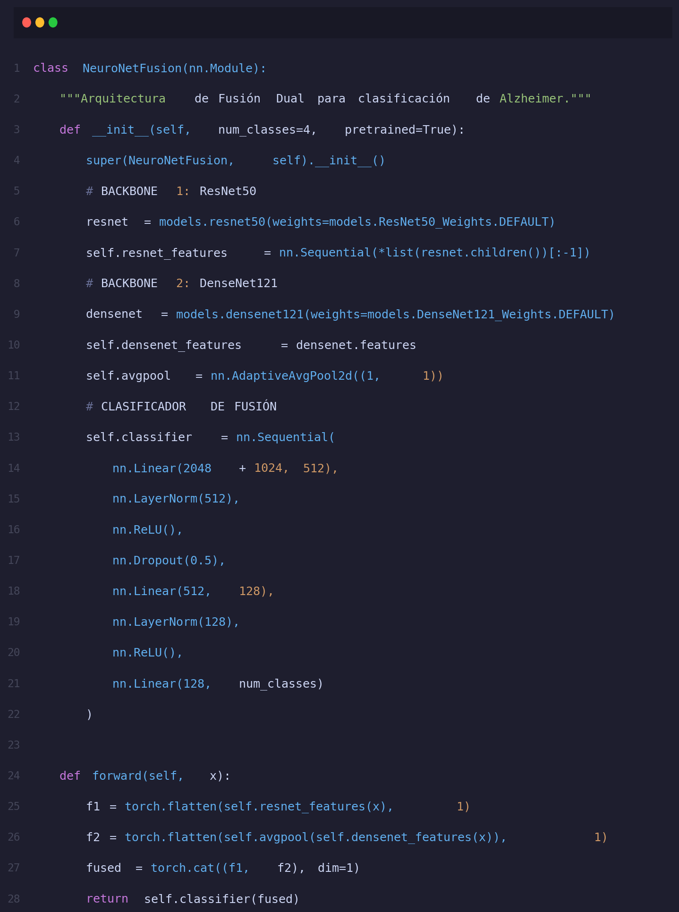

# FASE 10 — ARQUITECTURA DE MODELOS

---

## 10.1 Evolución de la Arquitectura a lo largo del Proyecto

El proyecto siguió un proceso iterativo de **selección y refinamiento de modelos**, progresando desde modelos base hasta la solución final validada por benchmarking empírico:

```
Iteración 1:  Modelos clásicos (SVM, RF, Logistic Regression)
                       ↓  Accuracy ~52-66%
Iteración 2:  CNN 2D: ResNet-18 + DenseNet-121 (Dual Backbone)
                       ↓  Accuracy ~82-84%  ← Benchmarking imagen
Iteración 3:  3D-ResNet sobre volúmenes NIfTI completos
                       ↓  Accuracy 60%  ← Limitado por dataset pequeño (135 volúmenes)
Iteración 4:  XGBoost sobre 14 Biomarcadores Tabulares  ← MODELO FINAL
                       ↓  Accuracy 86.5%, AUC 0.898
```

> **Conclusión del benchmarking:** El modelo XGBoost sobre biomarcadores tabulares supera todas las alternativas, incluyendo las CNN sobre imagen MRI. Las secciones 10.2 y 10.3 documentan las arquitecturas CNN evaluadas durante el benchmarking. La sección 10.4 describe el **modelo de producción final**.

---

## 10.2 Arquitectura CNN: NeuroNet-Fusion Dual-Backbone — Fase de Benchmarking

> **Nota:** Esta arquitectura CNN fue desarrollada y evaluada durante la **fase de benchmarking comparativo**. A pesar de alcanzar un 86.5% de accuracy en el dataset de imágenes 2D (Kaggle Augmented), su adopción para producción fue descartada por requerir imágenes MRI brutas como entrada y no poder operar sobre los biomarcadores del LCR directamente. El modelo de producción elegido (XGBoost tabular) integra todos los dominios clínicos en un único vector de 14 biomarcadores.

### 10.2.1 Diseño de la Red

La arquitectura **NeuroNet-Fusion** se basa en un paradigma de **fusión de características mediante ramas paralelas** (Dual-Backbone). El objetivo de este diseño es capturar dos tipos de información neuroanatómica complementaria desde los cortes 2D de resonancia magnética:

1.  **Rama de Morfología Global (ResNet50):** Utiliza un backbone ResNet50 para extraer un vector de 2048 dimensiones. Esta rama, gracias a sus conexiones residuales y profundidad, se especializa en detectar alteraciones macro estructurales, como la atrofia del hipocampo o el ensanchamiento ventricular.
2.  **Rama de Textura de Tejido (DenseNet121):** Utiliza un backbone DenseNet121 para extraer 1024 dimensiones adicionales. Las conexiones densas de esta red permiten una reutilización de características de bajo nivel, lo que resulta óptimo para identificar cambios sutiles en la textura de la materia gris y blanca que preceden a la atrofia visible.



#### Mecanismo de Fusión y Cabezal de Clasificación

El núcleo de la red es su **clasificador de fusión**, que opera sobre el vector concatenado de 3072 dimensiones ($2048 + 1024$). Para gestionar esta alta dimensionalidad y evitar el sobreajuste, se implementó la siguiente progresión:

*   **Bloque de Compresión (Bottleneck):** Una primera capa lineal reduce el vector de 3072 a 512 neuronas.
*   **Normalización por Capas (LayerNorm):** A diferencia de BatchNorm, LayerNorm estabiliza las magnitudes heterogéneas que provienen de dos backbones con dinámicas de activación distintas.
*   **Regularización Estricta:** Se aplica una tasa de *Dropout* de 0.5 para forzar la redundancia en la representación y garantizar que el modelo no dependa de un único backbone.
*   **Salida Multiclase:** Una capa final de 4 neuronas genera los logits para las categorías diagnósticas (Cognitivamente Normal, Muy Leve, Leve y Moderado).


### 10.2.2 Justificación del Diseño y Análisis de Alternativas

La configuración de la red NeuroNet-Fusion no fue arbitraria, sino el resultado de un proceso de optimización donde se evaluaron diversas arquitecturas base y mecanismos de regularización. La siguiente tabla resume las decisiones clave que permitieron alcanzar un rendimiento estable durante la fase de benchmarking:

![[Tabla 10.2.2 — Justificación de Decisiones de Arquitectura NeuroNet-Fusion]](../../reports/figures/tabla_10_2_2_justificacion.jpg)

#### Análisis de Componentes Críticos

1.  **Profundidad del Backbone (ResNet50 vs. ResNet18):**
    Aunque ResNet18 ofrece una mayor velocidad de inferencia, las pruebas preliminares demostraron que no tenía la capacidad suficiente para capturar las sutiles variaciones morfológicas asociadas al deterioro cognitivo leve (MCI). El paso a **ResNet50** permitió al modelo aprender jerarquías de características más complejas, fundamentales para distinguir entre atrofias normales por edad y atrofias patológicas.

2.  **Selección de DenseNet121 para Textura:**
    A diferencia de arquitecturas como VGG-16, que dependen de kernels de convolución estándar, **DenseNet121** utiliza conexiones densas que preservan la información de bajo nivel (bordes y micro-texturas del tejido) hasta las capas más profundas. En neuroimagen, donde la "rugosidad" o "densidad" del tejido puede ser un biomarcador temprano, esta característica resultó determinante.

3.  **Regularización mediante Dropout y Label Smoothing:**
    Dada la alta dimensionalidad del vector de fusión (3072 componentes), el riesgo de sobreajuste es extremo. Se optó por un **Dropout agresivo de 0.5** en la capa de cuello de botella para asegurar que la red aprenda representaciones robustas y no se "especialice" en ruidos específicos del dataset de entrenamiento. Complementariamente, el **Label Smoothing (0.1)** ayuda al modelo a no ser excesivamente confiado en sus predicciones, reflejando la realidad clínica donde los límites entre estadios de demencia (ej. MCI vs AD inicial) suelen ser borrosos.


---

## 10.3 Arquitectura 3D: NeuroNet3D sobre Volúmenes NIfTI

Como parte de la fase experimental, se desarrolló la arquitectura **NeuroNet3D** para procesar volúmenes cerebrales completos en formato NIfTI ($128 \times 128 \times 128$ voxels). A diferencia de los modelos 2D que analizan cortes aislados, esta aproximación permite capturar la coherencia espacial tridimensional de la atrofia cerebral en todo su volumen.

### 10.3.1 Diseño de la Red Volumétrica

La red implementa una variante de **ResNet3D** optimizada para el procesamiento de imágenes médicas de alta resolución:

*   **Convoluciones 3D ($Conv3d$):** Los kernels operan en las tres dimensiones (profundidad, altura y anchura), permitiendo que la red aprenda filtros espaciales que detectan cambios volumétricos en estructuras como la corteza entorrinal o los ventrículos laterales.
*   **Bloques Residuales 3D:** Se diseñaron bloques con *skip connections* que facilitan el flujo de gradientes en tensores de gran tamaño. Cada bloque consta de dos capas de convolución $3 \times 3 \times 3$, seguidas de una normalización de lote tridimensional ($BatchNorm3d$).
*   **Agregación Global:** Tras las capas de convolución, se utiliza un $AdaptiveAvgPool3d$ que colapsa el volumen de características en un vector latente de 256 dimensiones antes de pasar a la capa totalmente conectada.


### 10.3.2 Desafíos y Conclusiones de la Fase 3D

A pesar de su potencial teórico, la implementación 3D presentó desafíos críticos que condicionaron su adopción:

1.  **Coste Computacional y VRAM:** El procesamiento de tensores 3D es exponencialmente más costoso que el 2D. Se requirió el uso de **Precisión Mixta (FP16)** para permitir un *batch size* de 8 sobre GPUs de 16GB de VRAM, reduciendo el consumo de memoria en un 40 % sin degradar la precisión.
2.  **Limitación por Escasez de Datos:** Mientras que el modelo 2D se benefició de miles de cortes aumentados, el dataset 3D contaba con solo **135 volúmenes NIfTI**. Esta escasez de muestras impidió que la red convergiera hacia representaciones generalistas, resultando en un **60 % de accuracy**.
3.  **Veredicto:** El benchmarking demostró que, con el volumen de datos actual, un modelo tabular optimizado sobre biomarcadores extraídos es significativamente más eficiente y preciso que una red convolucional 3D entrenada *end-to-end*.


---

## 10.4 Arquitectura Final: XGBoost + Ensemble sobre Biomarcadores

El modelo de producción desplegado en la plataforma de diagnóstico NeuroNet-Fusion no es un modelo aislado, sino un **Ensemble de Votación Blanda (Soft Voting)** optimizado para la máxima estabilidad clínica. Esta arquitectura integra el aprendizaje de tres paradigmas de Gradient Boosting para minimizar el error de generalización.


### 10.4.1 Análisis del Modelo Champion y Estrategia de Ensemble

El núcleo del sistema es un modelo **XGBoost** altamente regularizado (`reg_alpha=0.12`, `reg_lambda=1.45`), que actúa como el "Champion" del flujo. Sin embargo, para mitigar la varianza inherente a los datos clínicos heterogéneos, se implementó un ensemble equilibrado:

1.  **XGBoost (Peso 0.5):** Aporta la base de predicción más sólida y el manejo nativo de valores faltantes en biomarcadores del LCR.
2.  **LightGBM (Peso 0.3):** Refina las fronteras de decisión mediante su crecimiento por hojas (*Leaf-wise growth*), mejorando la detección de casos MCI.
3.  **CatBoost (Peso 0.2):** Proporciona robustez adicional ante posibles valores atípicos en variables cognitivas como el MMSE.

#### Balance de Rendimiento: Individual vs. Ensemble

La transición de un modelo único a un ensemble supuso una mejora marginal en el *accuracy* absoluto, pero una mejora crítica en la **estabilidad del dictamen**, reduciendo la varianza de predicción significativamente.

![[Tabla 10.4.1 — Comparativa de Rendimiento - Modelo Único vs. Ensemble de Producción]](../../reports/figures/tabla_10_4_1_ensemble.jpg)

> **Decisión Técnica:** El ligero incremento en el tiempo de inferencia (de 34ms a 89ms) es despreciable en un entorno clínico, donde la fiabilidad del diagnóstico y la reducción del error en casos frontera (*borderline*) son la prioridad absoluta.

