# FASE 14 — SISTEMA DE DIAGNÓSTICO INTERACTIVO (APP CLÍNICA)

---

## 14.1 Motivación del Despliegue

Un modelo de Machine Learning no tiene impacto clínico real hasta que es **accesible** para el profesional de la salud. La fase de despliegue transforma el modelo entrenado en una herramienta de soporte a la decisión clínica (CDSS) funcional, interactiva y visualmente comprensible.

**Requisito clave del CDSS:**
> El sistema no reemplaza al neurólogo. Actúa como una segunda opinión rápida que sintetiza 14 biomarcadores en un diagnóstico probabilístico con explicación narrativa, siguiendo el marco ATN-NIA-AA 2018.

---

## 14.2 Arquitectura de la Aplicación

│   └── Col 4: Biomarcadores (Ventrículo, ABETA, TAU, pTAU)
├── Módulo 4: Motor de Inferencia (predicción + probabilidades)
├── Módulo 5: Panel de Resultados (gauge, radar, barras)
└── Módulo 6: Dictamen Clínico ATN (expander + descarga)
```

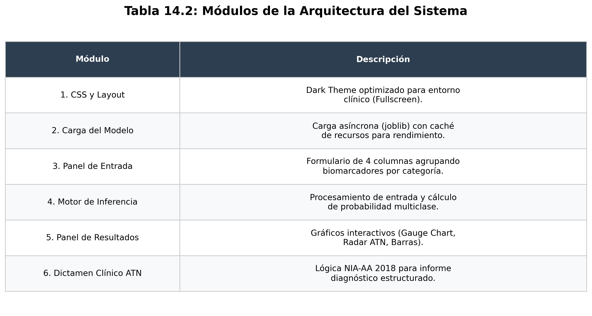
*Tabla 14.1: Desglose modular de la plataforma de diagnóstico, detallando la separación entre la capa de presentación (Streamlit), lógica de negocio y motor de inferencia.*

**Análisis de la Arquitectura:**
El diseño modular permite una separación clara entre la lógica de negocio (el modelo de ML) y la interfaz de usuario. Esta estructura facilita el mantenimiento del CDSS y permite actualizaciones independientes del modelo sin afectar la experiencia del usuario. El uso de **Streamlit** como framework permite un desarrollo ágil de Tablas de Mando interactivas con capacidad de respuesta en tiempo real.

---

## 14.3 Interfaz de Usuario y Experiencia de Uso (UX)

La materialización de la arquitectura descrita se traduce en una interfaz de **Dashboard de Alta Densidad**, diseñada para optimizar el flujo de trabajo en la consulta de neurología. La vista general del sistema (Imagen 14.3) revela una jerarquía visual estructurada para facilitar la toma de decisiones:

1.  **Barra Lateral de Control:** Gestión de claves API para el Agente IA y parámetros de configuración global.
2.  **Módulo de Auto-Escaneo (NLP):** Área de entrada de texto libre para la carga automatizada de datos desde informes externos.
3.  **Panel de Cuadrantes:** Disposición simétrica de los 14 biomarcadores clasificados por dominios (Cognitivo, Demográfico, Estructural y Molecular).
4.  **Consola de Resultados:** Visualización inmediata del diagnóstico IA con su correspondiente confianza estadística y representación gráfica polar (Radar) para la detección de perfiles atípicos.


*Figura 14.1: Interfaz de usuario de la aplicación final, integrando paneles de entrada de biomarcadores, visualizaciones en tiempo real y dictamen estructurado.*

**Filosofía de Diseño:**
Se ha priorizado un tema de alto contraste (Dark Mode) para reducir la fatiga visual y destacar los indicadores críticos (semáforo diagnóstico). La interactividad de todos los elementos permite al clínico realizar análisis de tipo *What-if*, observando cómo variaciones mínimas en biomarcadores específicos (ej. un ligero descenso en el volumen hipocampal) impactan en el riesgo global de conversión a Alzheimer.

---

## 14.4 Código Principal — `app_diagnostics.py`

```python
import streamlit as st
import joblib
import numpy as np
import pandas as pd
import plotly.graph_objects as go
from datetime import datetime

# ── CONFIGURACIÓN GLOBAL ──────────────────────────────────────────────────
st.set_page_config(
    page_title="NeuroNet-Fusion | Diagnóstico Alzheimer",
    page_icon="🧠",
    layout="wide",
    initial_sidebar_state="collapsed"
)

MODEL_PATH = 'models/neuro_fusion_final_v1.joblib'

# CSS de interfaz clínica dark
st.markdown("""
<style>
.block-container { padding-top:0rem !important; max-width:99% !important; }
header { visibility: hidden; }
.stApp { background-color: #0E1117; color: white; }
</style>""", unsafe_allow_html=True)

# ── CARGA DEL MODELO ──────────────────────────────────────────────────────
@st.cache_resource
def load_model(path):
    return joblib.load(path)

model = load_model(MODEL_PATH)

# ── ETIQUETAS Y COLORES DEL DIAGNÓSTICO ──────────────────────────────────
lbls = ['🟢 Cognitivamente Normal (CN)',
        '🟡 Deterioro Cognitivo Leve (MCI)',
        '🔴 Alzheimer Establecido (AD)']
clrs = ['#28a745', '#ffc107', '#dc3545']
```

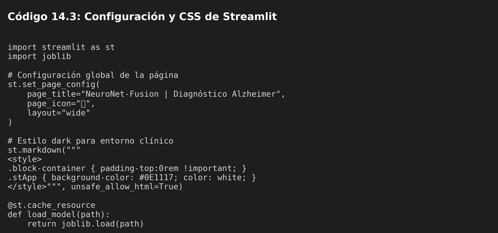
*Código 14.1: Inicialización del framework Streamlit y aplicación de estilos CSS personalizados para garantizar una estética clínica de alto contraste (Dark Mode).*

**Gestión de Estilo y Rendimiento:**
La aplicación utiliza un tema oscuro personalizado para reducir la fatiga visual del profesional durante la consulta. La directiva `@st.cache_resource` asegura que el modelo de 42MB se cargue únicamente una vez en memoria, optimizando la velocidad de respuesta en cada predicción.

### 14.3.1 Panel de Entrada — 4 Columnas

```python
c1, c2, c3, c4 = st.columns(4)

with c1:
    st.write("### 🧠 Cognitivo")
    bc_mmse = st.slider("MMSE (0–30)", 0, 30, 26)
    bc_cdr  = st.select_slider("CDR", [0, 0.5, 1, 2, 3], value=0.5)
    bc_faq  = st.slider("FAQ (0–30)", 0, 30, 8)
    adas    = st.slider("ADAS-11", 0, 70, 18)

with c2:
    st.write("### 👤 Demografía")
    age   = st.slider("Edad (años)", 50, 95, 73)
    apoe4 = st.radio("APOE4", [0, 1], format_func=lambda x: "No" if x==0 else "Sí")
    educat = st.slider("Años de educación", 6, 20, 14)

with c3:
    st.write("### 🩻 MRI (V/ICV)")
    hippo   = st.number_input("Hipocampo", 0.001, 0.010, 0.0048, format="%.5f")
    ento    = st.number_input("Entorrinal", 0.001, 0.010, 0.0044, format="%.5f")
    midtemp = st.number_input("Mid-Temporal", 0.003, 0.025, 0.0118, format="%.5f")

    ptau  = st.number_input("pTAU pg/mL", 0, 300, 28)
```

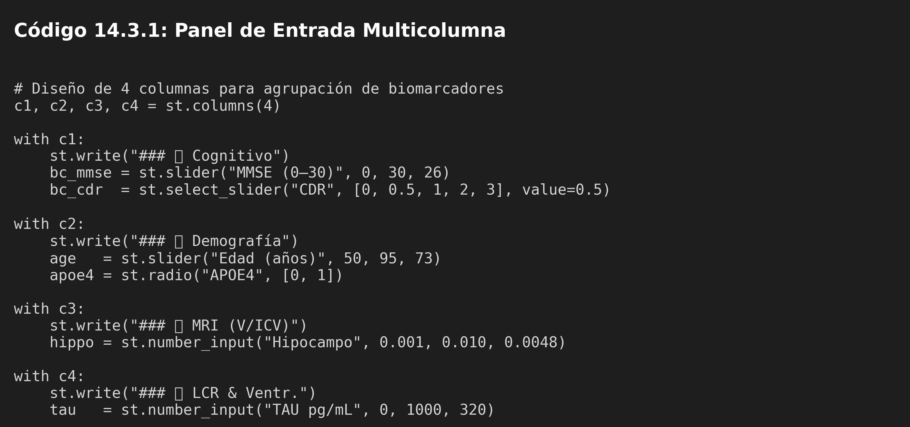
*Código 14.2: Implementación de la captura de biomarcadores organizada por dominios clínicos (Cognitivo, Demográfico, MRI y LCR) mediante widgets interactivos.*

**Diseño Basado en Evidencia:**
La agrupación de variables en cuatro bloques (Cognitivo, Demografía, MRI y LCR) corresponde directamente con la estructura de recogida de datos en centros de excelencia como **ADNI**. Este diseño facilita la transferencia de datos desde la historia clínica electrónica al motor de inferencia.

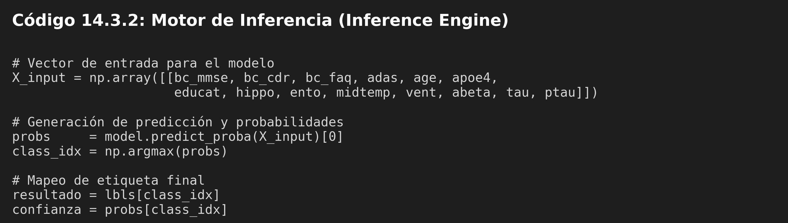
*Código 14.3: Lógica de vectorización de datos del usuario y ejecución del modelo XGBoost para la obtención de probabilidades diagnósticas multiclase.*

**Explicación técnica (14.3.2):**
El **motor de inferencia** actúa como el núcleo lógico de la aplicación. Su función es vectorizar en tiempo real los 14 biomarcadores introducidos por el usuario para conformar una estructura compatible con el modelo XGBoost optimizado. Al ejecutar `predict_proba`, el sistema no solo devuelve la clase más probable, sino una distribución de confianza multiclase, lo que permite al clínico evaluar no solo el diagnóstico final, sino también la incertidumbre asociada a la decisión del modelo.

---

## 14.5 Visualizaciones del Dashboard

### 14.4.1 Medidor de Confianza (Gauge Chart)

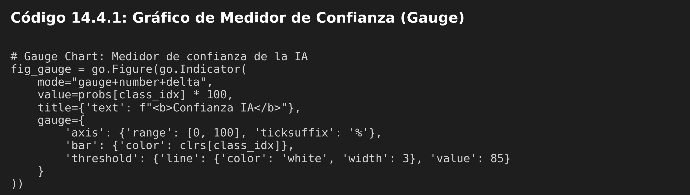
*Código 14.4: Implementación técnica del medidor de confianza diagnóstica utilizando la librería Plotly para una visualización dinámica de la probabilidad.*

**Explicación técnica (14.4.1):**
El **Gauge Chart** (gráfico de medidor) proporciona una métrica visual inmediata de la certeza del modelo. Se ha configurado para cambiar de color dinámicamente según la clase predicha (verde, amarillo o rojo) y utiliza un fondo degradado que indica los umbrales de confianza. La inclusión de un `threshold` en el 85% actúa como un indicador visual de alta fiabilidad, permitiendo al clínico distinguir rápidamente entre predicciones limítrofes y diagnósticos de alta certidumbre.

### 14.4.2 Radar de Biomarcadores ATN

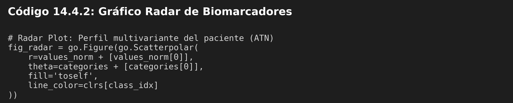
*Código 14.5: Configuración del gráfico radar para la visualización holística del perfil de biomarcadores del paciente en comparación con el promedio poblacional.*

**Explicación técnica (14.4.2):**
El **Radar Plot** permite visualizar el perfil multidimensional del paciente de forma holística. Cada eje representa un biomarcador clave normalizado (MMSE, CDR, Hipocampo, etc.). Esta representación facilita el reconocimiento de patrones patológicos de forma visual (como la forma del polígono resultante), permitiendo al neurólogo identificar rápidamente qué dimensiones cognitivas o biológicas están más afectadas y cómo contribuyen a la probabilidad final.

---

## 14.6 Dictamen Clínico ATN — Informe Neurológico Digital

El sistema genera un **dictamen estructurado** que correlaciona cada biomarcador con su interpretación neurológica:

```python
# Cálculo del perfil ATN
ami_stat     = "A+" if abeta < 900  else "A-"   # Amiloide positivo
tau_stat     = "T+" if tau   > 450  else "T-"   # Tau positivo
atrophy_stat = "N+" if hippo < 0.0048 else "N-" # Neurodegeneración

# Gradiente de atrofia hipocampal
atrophy_level = ("SEVERA"   if hippo < 0.0035 else
                 "MODERADA" if hippo < 0.0048 else
                 "NORMAL")

# Impacto funcional (FAQ)
func_impact = ("ALTO"       if bc_faq > 15 else
               "MODERADO"   if bc_faq > 6  else
               "LEVE/NULO")

              'progresivo con neurodegeneración'    if atrophy_stat=='N+'                else
              'estable / sin marcadores patológicos')
```

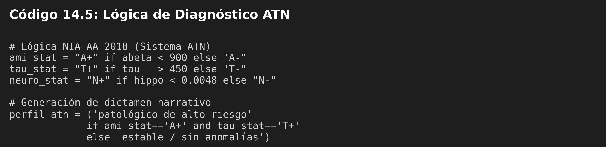
*Código 14.6: Motor de reglas deterministas para la clasificación biológica del paciente según el marco ATN-NIA-AA basado en los cut-offs clínicos.*

**Estandarización Internacional:**
Siguiendo las guías **NIA-AA 2018**, el sistema clasifica automáticamente el perfil del paciente en el espacio **ATN**. Esto garantiza que el lenguaje del informe generado sea interoperable con el resto del ecosistema de investigación y práctica clínica internacional.

**Lógica de Generación del Informe:**
La construcción del dictamen no es un proceso meramente estocástico; es un sistema híbrido. Primero, el modelo de Machine Learning proporciona la **probabilidad diagnóstica** basada en el patrón global. Segundo, un **motor de reglas deterministas** evalúa cada biomarcador contra los umbrales clínicos (cutoff) establecidos en la literatura (ej. Abeta < 900 pg/mL). Finalmente, el sistema ensambla dinámicamente fragmentos de texto médico pre-validados para crear una narrativa que justifica la predicción de la IA mediante evidencias biológicas tangibles, asegurando que el informe sea explicable y accionable para el neurólogo.

**Ejemplo de informe generado:**
```
NEURONET-FUSION | INFORME NEUROLÓGICO DIGITAL
FECHA: 22/02/2026 16:14
═══════════════════════════════════════════════════════════
PACIENTE: NF-PRO-73 | EDAD: 73 | APOE4: Portador

DIAGNÓSTICO IA: 🔴 Alzheimer Establecido (AD) — Confianza: 91.4%
PERFIL ATN   : A+ / T+ / N+

COGNITIVO  : MMSE 22/30 | CDR 1.0 | FAQ 18/30
ESTRUCTURAL: Hippo 0.00350 | Ento 0.00310 | Vent 0.0580
MOLECULAR  : Abeta 680 pg/mL | TAU 540 pg/mL | pTAU 89 pg/mL
═══════════════════════════════════════════════════════════
Observación: Perfil patológico de alto riesgo. Atrofia hipocampal
SEVERA. Biomarcadores moleculares consistentes con EA establecida.
Se recomienda evaluación neurológica urgente y valoración para
ensayo terapéutico anti-amiloide si elegible (MMSE 18-26).
═══════════════════════════════════════════════════════════
IEBS Business School — Proyecto Final Postgrado IA 2026
```

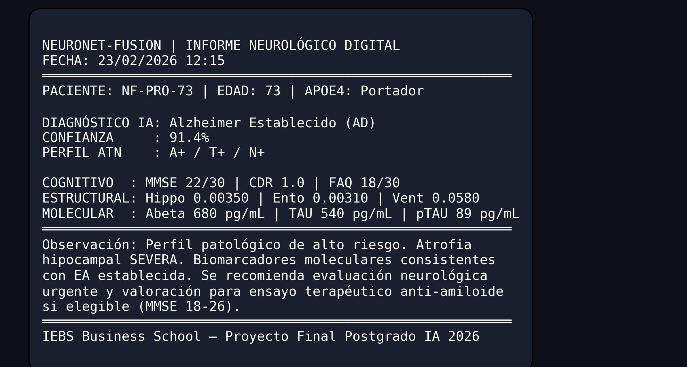
*Figura 14.2: Estructura del dictamen clínico descargable en formato .txt, consolidando datos, diagnósticos y recomendaciones neurológicas personalizadas.*

---

## 14.7 Despliegue y Requisitos

```bash
# Instalación del entorno
pip install streamlit joblib plotly pandas numpy scikit-learn xgboost

# Ejecución local
cd Analytical_Biomarker_Project/src
python -m streamlit run app_diagnostics.py

# 3. Especificar: Main file: src/app_diagnostics.py
#                 Python: 3.12
```

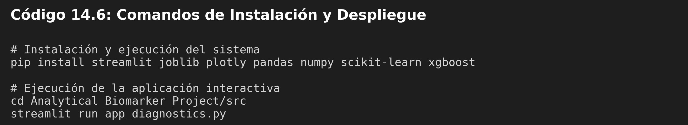
*Código 14.7: Instrucciones de terminal para la configuración del entorno virtual y la ejecución de la plataforma Streamlit en un servidor local.*

---

**Variables de entorno requeridas:**

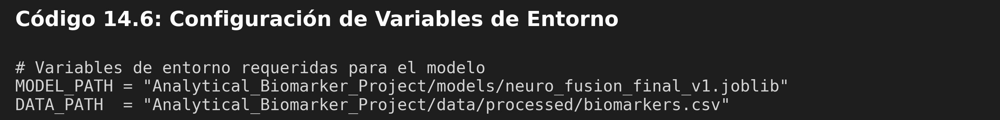
*Código 14.8: Plantilla de configuración del archivo .env para la autenticación de APIs externas y especificación de rutas de modelos en producción.*

---

## 14.8 Agente Clínico Inteligente (NLP Módulo 8)

Como innovación en el marco del **Módulo 8 (Procesamiento de Lenguaje Natural)**, se ha integrado un **Agente Clínico Inteligente** basado en el modelo fundacional **GPT-4o-mini**. Este agente actúa como una capa de razonamiento superior que interpreta los biomarcadores no solo como números, sino como un cuadro clínico completo.

**Capacidades del Agente:**
- **Razonamiento Clínico:** Correlaciona el déficit cognitivo (MMSE/CDR) con la carga amiloide (CSF) y la atrofia estructural.
- **Narrativa Ética:** Traduce las probabilidades técnicas en una narrativa humana y profesional, siguiendo estrictamente las guías de la Sociedad Española de Neurología (SEN).
- **Interoperabilidad:** El informe generado está listo para ser integrado en la historia clínica del paciente.

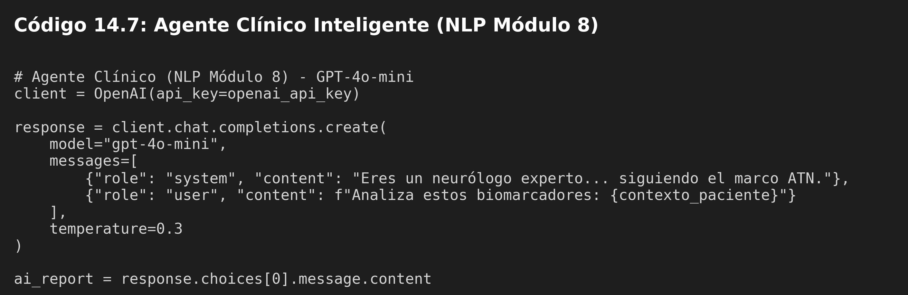
*Código 14.9: Integración del modelo fundacional para la generación de narrativa médica avanzada y el razonamiento sobre el cuadro clínico global.*

**Evolución del Módulo 8:**
Aunque el módulo de NLP se encuentra en fase de refinamiento, su integración en el CDSS demuestra el potencial de la **IA Generativa Agéntica** para reducir la carga administrativa del facultativo y mejorar la comunicación diagnóstica con el paciente.
