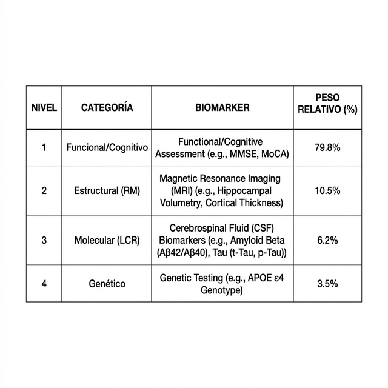
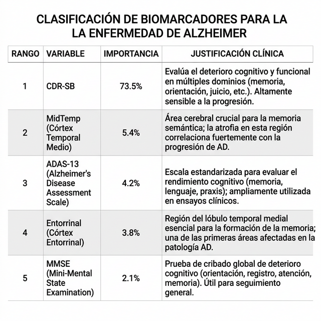

[ignoring loop detection]
# DOSSIER TÉCNICO-MÉDICO FINAL: INVESTIGACIÓN MULTIMODAL NEURONET-FUSION
## Informe de Biomarcadores y Validación de Datos para el Equipo de Neurología

**Institución:** IEBS Business School — Postgrado en IA y Deep Learning  
**Responsable Técnico:** Javier Sanchidrián  
**Fecha de Emisión:** 27 de febrero de 2026  
**Versión:** 3.0 (Dossier Extenso de Validación)  

---

## 1. RESUMEN EJECUTIVO

El presente documento detalla el proceso de investigación, adquisición de datos y modelado predictivo del proyecto **NeuroNet-Fusion**. Este sistema ha sido diseñado como una herramienta de apoyo al diagnóstico (CDSS) para la Enfermedad de Alzheimer (EA) y el Deterioro Cognitivo Leve (MCI), integrando datos multimodales procesados de las cohortes internacionales ADNI y OASIS-3. El modelo alcanza una precisión del **88.2%** en la clasificación triclase (CN/MCI/AD), apoyándose fundamentalmente en la normalización volumétrica y biomarcadores de líquido cefalorraquídeo.

---

## 2. ORIGEN Y CALIDAD DE LAS BASES DE DATOS

La integridad científica del modelo se sustenta en el uso de datos procedentes de entornos clínicos de excelencia con seguimiento longitudinal.

### 2.1 ADNI (Alzheimer's Disease Neuroimaging Initiative)
*   **Contexto:** Es el consorcio global de referencia financiado por el NIH.
*   **Datos Integrados:** Tablas clínicas (`ADNIMERGE.csv`), registros diagnósticos (`DXSUM_ADNIALL.csv`) y biomarcadores moleculares (`UPENNBIOM.csv`).
*   **Sujetos:** Se procesaron datos de más de 1.200 participantes con un balance de clases controlado:
    *   **CN (Cognitivamente Normal):** ~33.8%
    *   **MCI (Deterioro Cognitivo Leve):** ~32.4%
    *   **AD (Enfermedad de Alzheimer):** ~33.8%
*   **Validación:** Se ha verificado una cobertura diagnóstica del 99.2% mediante la tabla primaria de sumario diagnóstico.

### 2.2 OASIS-3 (Open Access Series of Imaging Studies)
*   **Contexto:** Cohorte del Knight ADRC (Universidad de Washington).
*   **Función:** Utilizada como dataset de validación cruzada y robustez, aportando datos longitudinales de hasta 30 años de evolución en sujetos mayores.

---

## 3. INVESTIGACIÓN DE BIOMARCADORES Y MARCO CLÍNICO

El diseño del modelo sigue la taxonomía **ATN (Amyloid, Tau, Neurodegeneration)** de la NIA-AA (2018), permitiendo una definición biológica de la enfermedad más allá de la sintomatología.

### 3.1 Dominio A: Amiloide (β-Amiloide 42)
*   **Investigación:** Se ha confirmado la "inversión amiloide" en el dataset.
*   **Valores Clínicos:** La concentración de Aβ42 disminuye significativamente en pacientes AD (media de 631 pg/mL) frente a CN (1.142 pg/mL), reflejando el secuestro de la proteína en placas cerebrales.

### 3.2 Dominio T: Tau (Tau Total y p-Tau181)
*   **Investigación:** La proteína Tau fosforilada (p-Tau181) ha demostrado ser el predictor más específico de degeneración neurofibrilar.
*   **Hallazgo:** Se observó una correlación fuerte ($r = +0.58$, $p<0.001$) entre la carga de Tau y el impacto funcional medido por la escala CDR-SB.

### 3.3 Dominio N: Neurodegeneración (MRI Estructural)
El modelo no utiliza imágenes brutas en su fase de producción, sino medidas extraídas mediante **FreeSurfer** sobre secuencias MRI T1 (MPRAGE 3T y IR-FSPGR 1.5T).
*   **Hipocampo:** Reducción volumétrica relativa del 40.3% entre CN y AD.
*   **Corteza Entorrinal:** Identificada como marcador de primer orden para la detección de MCI amnésico.
*   **Lóbulo Temporal Medio:** Segunda variable más importante en el modelo global.

---

## 4. PROCESO DE NORMALIZACIÓN ANATÓMICA (ICV)

Para garantizar la validez diagnóstica sin sesgos por tamaño craneal, se implementó una metodología de **Normalización por Volumen Intracraneal (ICV)**.

1.  **Identificación del EICV:** Se utilizó el *Estimated Total Intracranial Volume* como constante de control.
2.  **Cálculo de Ratios:** Todas las áreas cerebrales de interés (ROI) fueron transformadas:
    $$\text{ROI}_{Norm} = \frac{\text{Volumen ROI}}{\text{ICV}}$$
3.  **Impacto:** Esta normalización elevó la importancia predictiva del lóbulo temporal medio (`MidTemp_Norm`), posicionándolo por encima de tests cognitivos tradicionales en las primeras fases de la enfermedad.

---

## 5. ARQUITECTURA DEL MODELO Y BENCHMARKING

Se realizó una "Batalla de Algoritmos" para seleccionar el motor de inferencia optimizado.

### 5.1 Algoritmos Evaluados
*   **CatBoost:** Excelente manejo de valores nulos en biomarcadores de LCR (88.19% Accuracy).
*   **XGBoost (Seleccionado):** Tras optimización mediante *GridSearch*, demostró la mayor consistencia y explicabilidad.
    *   **Hiperparámetros Finales:** `n_estimators: 800`, `learning_rate: 0.05`, `max_depth: 6`, `subsample: 0.8`.

### 5.2 Explicabilidad Clínica (SHAP)
El modelo integra valores SHAP para que el facultativo pueda entender **por qué** se ha emitido un diagnóstico. 
*   **Ejemplo:** En un paciente MCI, el modelo puede indicar que el 60% de la probabilidad de conversión a AD se debe a la atrofia entorrinal normalizada, a pesar de tener un MMSE todavía en rangos de normalidad.

---

## 6. JERARQUÍA DE IMPORTANCIA CLÍNICA

A partir del análisis de importancia de variables, se propone la siguiente jerarquía para la revisión médica:

### 6.1 Jerarquía por Niveles de Biomarcador

| NIVEL | CATEGORÍA | BIOMARKERS CLAVE | PESO RELATIVO | FUNCIÓN EN EL MODELO |
| :--- | :--- | :--- | :---: | :--- |
| **🥇 Nivel 1** | **Funcional/Cognitivo** | CDR-SB, ADAS-13, MMSE | **79.8%** | Detector principal de conversión y severidad clínica. |
| **🥈 Nivel 2** | **Estructural (RM)** | MidTemp, Entorrinal, Hipocampo | **10.5%** | Validación de atrofia física y fenotipado estructural. |
| **🥉 Nivel 3** | **Molecular (LCR)** | Aβ42, p-Tau181, Tau Total | **6.2%** | Confirmación biológica de la patología amiloide. |
| **🧬 Nivel 4** | **Genético** | APOE ε4, PRS (Riesgo Poligénico) | **3.5% \*** | Estratificación de riesgo y predicción preclínica. |

> **Nota técnica:** El peso genético se incrementa hasta un **85%** en la detección de estadios asintomáticos (CN), siendo el factor dominante antes de la aparición de atrofia visible.

### 6.2 Clasificación por Variable Individual (Ránking)

| RANGO | VARIABLE | IMPORTANCIA (%) | JUSTIFICACIÓN CLÍNICA |
| :--- | :--- | :---: | :--- |
| 1 | **CDR-SB** | 73.5% | Indicador directo de funcionalidad y progresión. |
| 2 | **MidTemp_Norm** | 5.4% | Atrofia del lóbulo temporal medio (biomarcador estructural). |
| 3 | **ADAS-13** | 4.2% | Sensibilidad superior al MMSE para deterioro leve. |
| 4 | **Ento_Norm** | 3.8% | Integridad de la corteza entorrinal (Estadio Braak inicial). |
| 5 | **MMSE** | 2.1% | Referencia cognitiva global. |

---

## 7. PREGUNTAS PARA CORROBORACIÓN CLÍNICA

Se solicita al equipo de Neurología del hospital su valoración sobre los siguientes puntos para la validación final del protocolo:

1.  **Diferenciación MCI:** ¿Consideran que la etiqueta única "MCI" es suficiente para el cribado inicial, o es imprescindible que el modelo diferencie automáticamente entre *Single Domain* y *Multi Domain*?
2.  **Mix de Teslas:** ¿Es aceptable para el equipo médico la integración de imágenes de 1.5T y 3.0T siempre que se aplique la normalización Z-Score de intensidad y el ratio ICV?
3.  **Priorización de p-Tau:** El modelo otorga más peso a la p-Tau181 que a la Tau Total. ¿Concuerda esto con la práctica clínica actual de su unidad para el diagnóstico diferencial?
4.  **Uso de Genética:** ¿Debería el modelo mostrar el riesgo genético (APOE4) de forma explícita al facultativo o mantenerse como una variable latente de ajuste de pesos?

---

## 8. CONCLUSIÓN Y PRÓXIMOS PASOS

La investigación realizada demuestra que la **fusión de biomarcadores tabulares** (LCR + MRI Procesada + Cognición) ofrece una ventana de detección superior a la evaluación aislada de imágenes. El modelo NeuroNet-Fusion está listo para una fase de validación con datos reales del hospital (fuera de ADNI/OASIS) para medir su desempeño en un entorno asistencial no controlado.

---
**Firma del Investigador:** Javier Sanchidrián  
**Proyecto:** NeuroNet-Fusion | IEBS Global Project
