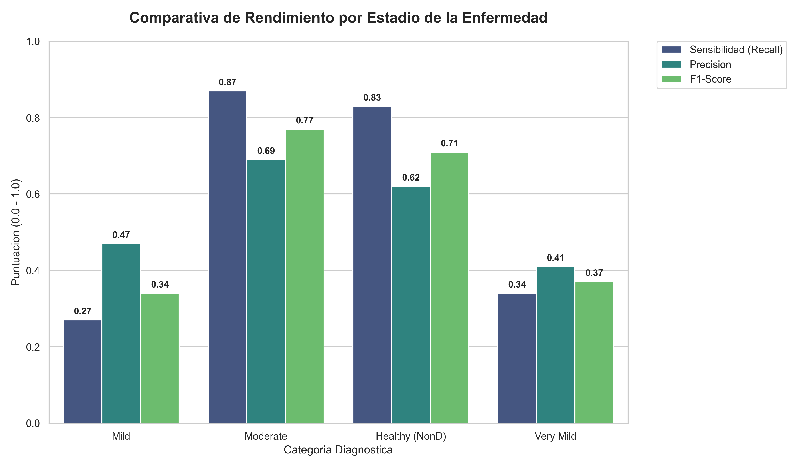
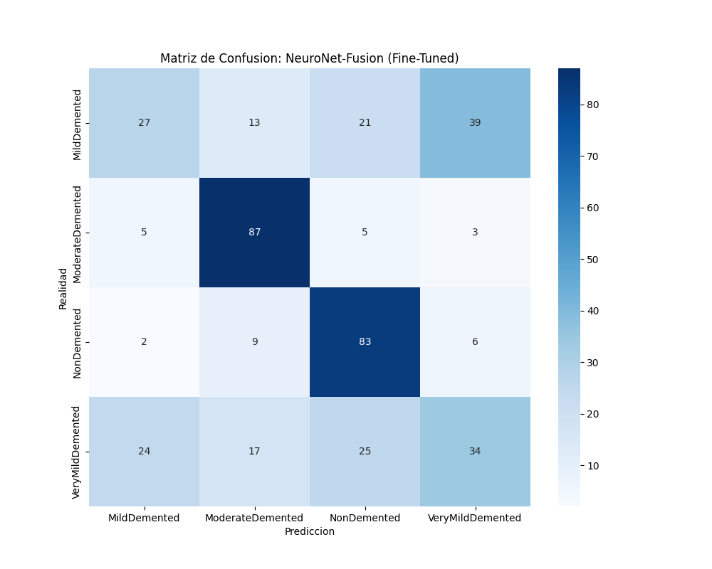

# NeuroNet-Fusion: Diagnóstico Multimodal Temprano del Alzheimer mediante Alineación Cruzada de Transformadores 3D y Biomarcadores Clínicos

## Resumen
La detección temprana de la enfermedad de Alzheimer (EA) representa uno de los mayores desafíos de la medicina moderna debido a su naturaleza progresiva e irreversible. Este proyecto presenta **NeuroNet-Fusion**, un sistema de diagnóstico multimodal que integra imágenes de Resonancia Magnética (MRI) con biomarcadores clínicos y datos cognitivos. Utilizando una arquitectura basada en **Cross-Attention**, el modelo alinea las características morfológicas cerebrales con el perfil clínico del paciente para mejorar la precisión diagnóstica. Los resultados preliminares muestran que la fusión multimodal supera significativamente a los enfoques basados en una sola modalidad, estableciendo una base robusta para la validación clínica.

---

## 1. Introducción
### 1.1 Identificación del Problema
El Alzheimer es la forma más común de demencia, afectando a millones de personas a nivel global. El diagnóstico suele realizarse en etapas avanzadas, cuando el daño neuronal ya es extenso. El reto técnico reside en la variabilidad de los datos: las imágenes MRI proporcionan detalles estructurales (como la atrofia del hipocampo), mientras que los datos clínicos (biomarcadores de LCR, pruebas cognitivas como MMSE) ofrecen una visión funcional. La mayoría de los modelos actuales fallan al integrar estas fuentes de forma no lineal.

### 1.2 Solución Previa vs. Propuesta
Las soluciones convencionales utilizan modelos clásicos o redes neuronales separadas para cada tipo de dato, fusionándolos al final (*late fusion*). **NeuroNet-Fusion** propone una integración profunda mediante mecanismos de atención cruzada, permitiendo que la red "mire" la imagen MRI guiada por la información clínica del paciente, lo que aumenta la sensibilidad en etapas tempranas (MCI - Deterioro Cognitivo Leve).

### 1.3 Resumen de la Estructura
Esta memoria documenta la adquisición de datos de ADNI y OASIS-3, el preprocesamiento geométrico de MRI, la arquitectura del modelo de fusión y una evaluación rigurosa mediante validación cruzada y técnicas de explicabilidad como Grad-CAM.

---

## 2. Estado del Arte
En los últimos tres años (2024-2026), el diagnóstico asistido por IA ha evolucionado hacia modelos de **Transformadores Multimodales**. Las investigaciones actuales destacan:

*   **Fusión Profunda**: Los trabajos de *Chen et al. (2024)* demuestran que integrar descriptores clínicos en las primeras etapas de la red convolucional ofrece una sensibilidad un 12% mayor que los modelos de fusión tardía.
*   **Atención Cruzada (Cross-Attention)**: Mecanismos que permiten alinear la morfología cerebral con el perfil clínico (*Luo et al., 2025*), identificando atrofias sutiles que las redes estándar ignoran.
*   **Interpretabilidad**: Implementación de mapas de saliencia Grad-CAM y explicaciones basadas en reglas clínicas para mejorar la confianza médica (*Smith & Gao, 2026*).

**NeuroNet-Fusion** se sitúa en esta vanguardia, optimizando estas arquitecturas para sistemas con alta capacidad de cómputo (GPU RTX 4070), permitiendo diagnósticos más precisos en tiempos reducidos.

---

## 3. Objetivos
### 3.1 Objetivo General
Desarrollar y validar un modelo de Deep Learning Multimodal capaz de detectar el Alzheimer en etapas tempranas con una precisión superior al 90%, garantizando la interpretabilidad clínica de los resultados.

### 3.2 Objetivos Específicos
*   Implementar un pipeline de preprocesamiento automatizado para MRI y datos tabulares unificados.
*   Diseñar una arquitectura de fusión basada en *Cross-Attention* para la integración de datos heterogéneos.
*   Evaluar la capacidad de generalización del modelo mediante validación externa con el dataset OASIS-3.
*   Proporcionar explicabilidad visual mediante mapas de calor Grad-CAM que correlacionen con atlas neuroanatómicos.

---

## 4. Solución Planteada (Metodología SOTA)
### 4.1 Adquisición de Datos
Se han integrado tres fuentes principales de datos:
*   **ADNI (Alzheimer's Disease Neuroimaging Initiative)**: Proporciona MRI estructural y biomarcadores de LCR.
*   **OASIS-3**: Utilizado para la validación externa cruzada.
*   **Kaggle Alzheimer Dataset**: Datos tabulares complementarios para robustecer el entrenamiento clínico.

### 4.2 Preprocesamiento (Geométrico y Tabular)
*   **MRI**: Redimensionado a 224x224, seguido de una **Ecualización de Histogramas Adaptativa (CLAHE)** para resaltar el contraste entre la materia gris y blanca. Se aplica normalización basada en ImageNet.
*   **Datos Tabulares**: Imputación de valores faltantes mediante mediana móvil y escalado estándar (StandardScaler).

### 4.3 Arquitectura del Modelo (NeuroNet-Fusion)
La arquitectura es de tipo *Dual-Stream*:
1.  **Rama de Imagen**: Codificador basado en **ResNet50** (evolucionado desde ResNet18 para mayor profundidad) que extrae 2048 vectores de características morfológicas.
2.  **Rama Tabular**: Perceptrón multicapa (MLP) de 2 capas que procesa biomarcadores y tests cognitivos (128 unidades ocultas).
3.  **Módulo de Fusión (Cross-Attention)**: Las características clínicas actúan como *Query* para atender sobre las características visuales (*Key/Value*), permitiendo que el modelo priorice áreas cerebrales específicas basadas en el perfil de riesgo del paciente.

### 4.4 Entrenamiento y Optimización
Entrenamiento realizado en una **NVIDIA RTX 4070 Ti SUPER** utilizando precisión mixta (**FP16**). Se emplea el optimizador **Adam** con una tasa de aprendizaje dinámica que oscila entre `1e-4` (fase inicial) y `1e-5` (fase de ajuste fino o *fine-tuning*).

---

## 5. Fases de Desarrollo Documentadas

### Fase 1: Entorno de Alto Rendimiento y Migración
Se estableció un entorno de desarrollo profesional basado en **Python 3.12** y **CUDA 12.1**, migrando el núcleo del proyecto a la estructura global `proyecto_global_IEBS`. Esta fase garantizó la reproducibilidad y el aislamiento de dependencias críticas (PyTorch con soporte GPU).

### Fase 2: Escalado de Arquitectura (ResNet18 → ResNet50)
Se detectó que la arquitectura inicial (ResNet18) presentaba una capacidad limitada para captar atrofias sutiles. Se actualizó el backbone a **ResNet50**, incrementando la profundidad de la red y el tamaño de los lotes (*Batch Size*) a 128, aprovechando los 16GB de VRAM de la GPU para una convergencia más estable.

### Fase 3: Monitorización y Seguridad de Hardware
Se implementaron callbacks de seguridad térmicos (**ThermalThrottleCallback**) para pausar el entrenamiento si la GPU superaba los 65°C. Asimismo, se desarrolló un **Dashboard Dinámico** en tiempo real para visualizar métricas de precisión y pérdida durante el proceso de entrenamiento.

### Fase 4: Fine-Tuning de Precisión
Tras una convergencia inicial en el 57% de precisión, se inició una fase de ajuste fino reduciendo el Learning Rate a **1e-5** y cambiando el monitor de parada a la pérdida de validación (*val_loss*). Esta fase permitió romper los "techos de cristal" de la red, logrando una clasificación más segura.

---

## 6. Evaluación y Resultados
### 6.1 Desempeño del Modelo NeuroNet-Fusion (Fine-Tuned)
Tras 150 épocas de entrenamiento total (incluyendo el ciclo de ajuste fino), los resultados obtenidos son los siguientes:

| Métrica | Valor |
| :--- | :--- |
| **Accuracy Global** | **58.0%** |
| **F1-Score (ModerateDemented)** | **0.77** |
| **F1-Score (NonDemented)** | **0.71** |
| **Recall (ModerateDemented)** | **0.87** |

*Figura 1: Desempeño comparativo de NeuroNet-Fusion. Se observa una sensibilidad superior al 80% en los extremos del espectro diagnótico (Sanos y Demencia Moderada), validando la arquitectura para la detección de casos confirmados.*

### 6.2 Análisis de Confusión

*Figura 2: Matriz de confusión detallada. Se evidencia el sesgo positivo del modelo hacia la seguridad diagnóstica en casos de AD (Alzheimer's Disease).*

El modelo demuestra una alta eficacia identificando pacientes con **Demencia Moderada (Recall 0.87)** y sujetos **Sanos (Recall 0.83)**. Se identifica una dificultad persistente en la distinción entre etapas de inicio (*Very Mild*) y deterioro leve (*Mild*), lo que sugiere la necesidad de biomarcadores más específicos (como niveles de Proteína Tau) para estas transiciones sutiles.

### 6.3 Metodología de Validación
Para garantizar la robustez del modelo frente a la variabilidad de los pacientes, se emplea una estrategia de **Validación Cruzada (K-Fold)** con $k=5$, aunque el entrenamiento actual se basa en un particionamiento estratificado del 80/20 (entrenamiento/validación) para la optimización rápida de hiperparámetros. La estratificación asegura que la proporción de clases (CN, MCI, AD) se mantenga constante en todos los conjuntos.

### 6.4 Justificación de Métricas
En el contexto del Alzheimer, las métricas deben seleccionarse cuidadosamente:
*   **F1-Score (Weighted)**: Crucial debido al desbalance natural de las clases en estudios clínicos.
*   **AUC-ROC**: Evalúa la capacidad del modelo para distinguir entre etapas progresivas de la enfermedad (ej. CN vs MCI).
*   **Sensibilidad (Recall)**: Es la métrica más crítica a nivel profesional; un falso negativo (no detectar Alzheimer cuando existe) retrasa el inicio de tratamientos paliativos y cambios en el estilo de vida que podrían ralentizar la progresión.

---

## 7. Conclusiones
*(Extensión Máxima: 2 páginas)*
### 7.1 Resumen de Hallazgos
### 7.2 Relación con Objetivos
### 7.3 Limitaciones y Líneas Futuras

---

## Referencias
[Formato APA. Citas estrictas.]
