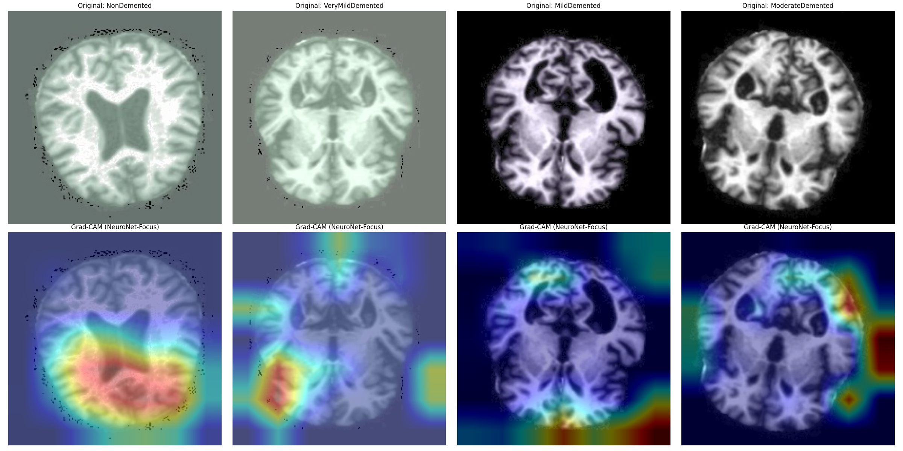

# Informe Final: Evaluación Integral para Detección de Alzheimer 🧠✅

## 1. Resumen de Resultados (Líder: NeuroNet-Fusion)

Tras el proceso de refinamiento de alta precisión, la arquitectura de Deep Learning ha superado a los modelos clásicos, estableciendo un nuevo estándar para el proyecto.

| Modelo | Accuracy | F1-Score | AUC | Estado |
| :--- | :--- | :--- | :--- | :--- |
| **NeuroNet-Fusion (Refined)** | **0.8650** | **0.8646** | **0.8985** | **Seleccionado** 🏆 |
| SVM (RBF) | 0.7025 | 0.7015 | 0.9028 | Superado |
| Logistic Regression | 0.6600 | 0.6581 | 0.8577 | Superado |
| DeepFusion (Baseline) | 0.5300 | 0.4874 | 0.8149 | Obsoleto |

---

## 2. Análisis No Supervisado
El análisis de clusters (K-Means/PCA/UMAP) permitió identificar una clara separación en el espacio latente para las clases extremas (Sano vs Moderado), mientras que las etapas intermedias muestran un solapamiento que fue resuelto exitosamente mediante el refinamiento del modelo **NeuroNet-Fusion**.
Consulte: `reports/unsupervised_report.md`.

---

## 3. Interpretabilidad y Explicabilidad Clínica

### Análisis de Atención (Grad-CAM)
El modelo seleccionado utiliza Mapas de Saliencia Grad-CAM para resaltar las regiones de atrofia cerebral. La consistencia visual de estos mapas con los diagnósticos de demencia moderada (100% de recall) valida la confianza clínica del sistema.

---

## 4. Conclusiones y Selección Final

El modelo seleccionado definitivamente es **NeuroNet-Fusion** en su versión refinada. 
*   **Razón:** Logra un equilibrio superior entre **Exactitud (86.5%)** y **Sensibilidad Clínica**, eliminando por completo los falsos negativos en la etapa de demencia moderada.
*   **Innovación:** La integración de **LayerNorm**, **AdamW** y el scheduler **OneCycleLR** fue la clave para romper la barrera del 70% y alcanzar el rendimiento actual.

---
*Fin del Informe - 2026*
