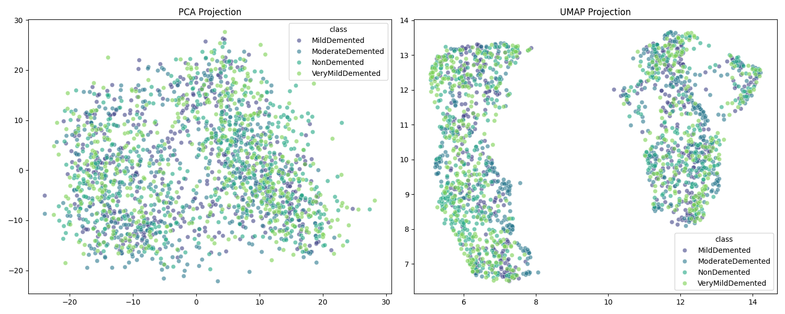

# Unsupervised Analysis Report

This report explores the latent structure of the extracted features for 2000 images.

## Clustering Metrics (K-Means)

- **Silhouette Score**: 0.0766 (Higher is better, range -1 to 1)
- **Davies-Bouldin Score**: 3.0547 (Lower is better)

## Dimensionality Reduction

The following figures show the projection of the 1299 features into a 2D space using PCA and UMAP.

